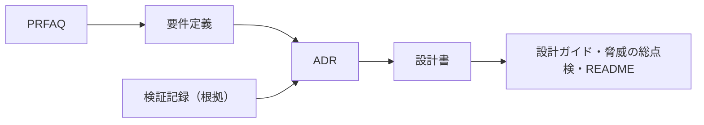

# gekko_08

このリポジトリで文書とコードを書く人（Claude Codeを含む）のための運用ルール。読者向けの文書の案内は[docs/README.md](docs/README.md)にある。

- 新しい情報は、下の文書一覧に照らして置き場所を決める。どの文書にも当てはまらない場合は、先にこの一覧を更新する。
- 判断の根拠は要件に置く（[判断の根拠は要件に置く](#判断の根拠は要件に置く)）。
- 作業メモは[TODO.md](TODO.md)冒頭の運用ルールに従う。

## 文書一覧

このリポジトリで作る文書と、それぞれが定義する範囲・対象読者を示す。

| 文書 | 場所 | 定義する範囲 | 書かないもの | 対象読者 | 状態 |
|---|---|---|---|---|---|
| PRFAQ | [docs/prfaq/](docs/prfaq/) | 何を作るのか、なぜ作るのか。想定顧客、価値、既存の解決策との違い、作る価値とリスク | 要件の一覧、実現方法の詳細 | プロジェクトオーナーと協力者 | 作成済み |
| 要件定義 | [docs/requirements.md](docs/requirements.md) | 参照実装が満たすべきこと。機能・非機能・セキュリティ要件、前提と範囲、将来の拡張、スコープ外 | 実現方法、設計上の判断、作業の予定 | プロジェクトオーナーと協力者、設計者 | 作成済み |
| ADR | [docs/adr/](docs/adr/)（`YYYYMMDDHHMMSS-<slug>.md`、UTC。[索引](docs/adr/README.md)） | 個々の設計判断。背景、決定、採用しなかった選択肢、結果として引き受けること | 判断を伴わない構成の説明、未決事項（作業メモに書く） | 設計者、実装者 | 随時。[ADRの扱い](#adrの扱い)に従う |
| 設計書 | [docs/design/architecture.md](docs/design/architecture.md) | 参照実装の現在の構成。コンポーネント、呼び出しの流れ、IAMとポリシー、共通部品、追跡、デモ、CDKの構成、テストと要件の対応。ADRで決めた内容を1つの姿に統合する | 判断の経緯（ADRに書く）、要件、実測値と運用の手引き（設計ガイドに書く） | 実装者 | 作成済み |
| 検証記録 | `experiments/*/RESULTS.md` | 実機検証の目的、構成、観測した事実、設計への示唆 | 決定（ADRに書く） | ADRの根拠を確かめたい人 | 検証ごとに作成 |
| 設計ガイド | [docs/guide.md](docs/guide.md) | 参照実装の利用者向けの説明。仕組みと用語、各判断の根拠、自分のシステムへの当てはめ方、この構成が守らないもの、運用（トレースとログの見方、レイテンシの実測、規模の上限）、将来の拡張の方向 | 内部の作業情報、構成の詳細（設計書に書く） | 参照実装を使うエンジニア | 作成済み。設計書とは分ける |
| 脅威の総点検 | [docs/threats.md](docs/threats.md) | 既知の攻撃の一覧と、それぞれを止める層、証拠（テスト、検証記録）、防がないもの | 侵害された要素ごとの影響の要約（設計ガイド§5に書く）、構成の詳細 | 参照実装を使うエンジニア、レビューする人 | 作成中。攻撃やテストを足したら更新する |
| README | [README.md](README.md) | 参照実装の概要と位置づけ、守れる範囲の要約、費用、始め方（`cdk deploy`まで）、デモの手順と期待する結果、片付け | 設計の詳細 | 参照実装を使うエンジニア | 作成済み。実装に合わせて更新する |
| 構成図 | [docs/diagrams/](docs/diagrams/README.md) | 全体構成の図（AWSの公式アイコン）。生成するコードが正本で、生成した画像も置く | 構成の詳細（設計書に書く） | 参照実装を使うエンジニア | 構成を変えたら生成し直す |
| 文書の案内 | [docs/README.md](docs/README.md) | 読者がどの順で何を読むか | 運用ルール（このファイルに書く） | 参照実装を使うエンジニア | 作成済み |
| 作業メモ | [TODO.md](TODO.md) | 未決事項と作業の予定 | 要件、決定、完了した項目 | プロジェクトオーナーと作業者 | 完了した項目は削除し、空に近づける（運用ルールはファイル冒頭） |

## 運用ルール

### 文書の順序とリンクの向き

文書は次の順に作る。下流の文書は上流の文書を元にし、上流の文書は下流の文書を前提にしない。

- リンクは、下流から上流へだけ張る。上流の文書から下流の文書へはリンクせず、下流の内容を前提にした記述もしない。
- ADRどうしは、置き換えや改訂の関係を両方向に記録してよい。設計ガイド・脅威の総点検・READMEは、互いにリンクしてよい。
- 検証記録は観測した事実なので、どの文書からも根拠として参照してよい。PRFAQが根拠に使えるのは、検証記録と外部の出典だけである。
- 文書の案内と作業メモは、どの文書にもリンクしてよい。

### 事実の正本

同じ事実を複数の文書に書くと、変更のたびにずれる。事実の種類ごとに正本を1つ決め、ほかの文書は要約にとどめて正本へリンクする（リンクの向きの規則の範囲で）。

| 事実の種類 | 正本 |
|---|---|
| 何を・なぜ作るのか（課題、価値、既存の解決策との関係、リスク） | PRFAQ |
| 満たすべきこと、前提と範囲、将来の拡張、スコープ外 | 要件定義 |
| 判断、その根拠、採らなかった選択肢 | ADR |
| 現在の構成（構成要素、IAM、共通部品の動き、スパンの属性、デモ、テストと要件の対応） | 設計書 |
| 利用者に公開する実測値（レイテンシ、スパンの量）、運用の方法（トレースとログの見方） | 設計ガイド |
| デモの手順と期待する結果 | README |
| 既知の攻撃と、それを止める層・証拠 | 脅威の総点検 |
| 実機で観測した事実 | 検証記録 |
| 未決事項と作業の予定 | 作業メモ |

ADRが決めたときの根拠として引く数値は、そのときの記録として残してよい。

### 日付

日付はUTCで書く（ADRのファイル名と状態、検証記録の実施日、文書の中の観測日）。

### ADRの扱い

- 見出しは「状態」「背景」「決定」「採用しなかった選択肢」「結果として引き受けること」にそろえる。
- 決定を置き換えたADRは、削除せずに残す。「状態」を「置き換え済み」にし、置き換えたADRへリンクする。
- 決定の一部だけを置き換えたADRは、「状態」の冒頭に、今有効な決定を1行で書く。
- 例外として、残しておくと明らかに読者の混乱を招くだけのもの（すぐに撤回した判断、誤記の訂正に近いものなど）は、削除してよい。
  削除するときは、そのADRへのリンクをすべて直す。

### 判断の根拠は要件に置く

- 設計・実装・テストが正しいかどうかは、[要件定義](docs/requirements.md)に照らして判断する。設計書もコードも判断の根拠にしない。
- 設計書と実装は最終的に一致させる。食い違いや問題が見つかったら、要件に照らしてどちらを直すかを決める。
  - 実装が設計書どおりになっていない（設計書は要件を満たしている）場合は、実装を直す。
  - 設計書どおりでは要件を満たせない場合や、要件（非機能要件を含む）をよりよく満たす方式が見つかった場合は、設計書を見直し、
    実装もそれに合わせる。大きな変更はADRとして相談する。
  - 「実装がそう動いたから」という理由だけで設計書を書き換えない。
- 要件そのものが誤っている、または満たせないとわかった場合は、要件を見直す。
- 要件の変更は、プロジェクトオーナーの合意を得てから行う。設計の大きな変更は、ADRとして相談してから確定する。
- 振る舞いを確かめるテスト（シナリオテスト、受け入れテスト）は要件のID（FR-1、SR-2など）にひも付け、失敗したときにどの要件が
  満たせていないかがわかるようにする。共通部品の単体テストなど、部品の仕様を確かめるテストはひも付けない。
