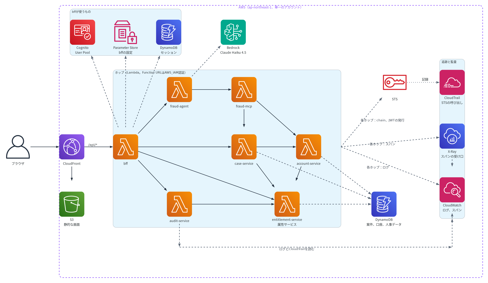

# gekko_08 — 「誰の権限で」を最後のホップまでAWS IAMに強制させる参照実装

> **English summary.** A reference implementation that carries *on whose behalf* (the user) and *for what* (the purpose) through
> every hop of a multi-hop call chain on AWS, with no authorization server and no sidecar — only Cognito, STS (role chaining with
> transitive session tags, and `GetWebIdentityToken` from IAM outbound identity federation), IAM and Lambda. Each hop verifies who
> the user is, which service called it, that the token is for itself, and what it may do; IAM, not application code, enforces the
> delegated scope. Includes an AI agent (Claude Agent SDK) and an MCP server as hops, and an audit view that matches each hop's
> log against CloudTrail. Documentation is in Japanese. Not for production use; no support.

AWS上のマイクロサービスで、Authorization Context（誰の権限で処理するのか）とWorkload Identity（どのサービスが呼んでいるのか）を分け、
多段呼び出しの奥まで届ける仕組みの参照実装。認可サーバーもサイドカーも置かず、Cognito・STS・IAM・Lambdaだけで、OAuth Token Exchangeと
同等の4つの検証（各ホップが「誰の代理か」「どのサービスから来たか」「自分宛てか」「代理として何を許されているか」を確かめる）を行う。
委任の範囲は、実行時の交換ではなくデプロイ時の宣言で絞る（違いは[PRFAQ Q1](docs/prfaq/aws-authorization-context-propagation.md#q1-oauth-token-exchangeと何が違うのか)）。

仕組みを確かめ、自分のシステムに当てはめるための参照実装である。本番での利用は想定しておらず、サポートやSLAもない。
前作では、同じ問題をOAuth Token Exchangeで解き（[記事](https://zenn.dev/akring/articles/1a9f25fd6b04ab)）、AIエージェントへのプロンプトインジェクションを
認可で止められることを確かめた（[記事](https://zenn.dev/akring/articles/1c25b8f471f92d)）。この参照実装は、それを認可サーバーなしで行う。

認可の根拠は、身元（誰の代理か、どのサービスから来たか）、委任の範囲（このリクエストで何を許すか。IAMが強制する）、
業務上のアクセス権（このユーザーはこのデータを扱ってよいか。属性サービスが答える）の3つの層に分け、すべてが許すときだけ処理する
（[設計ガイド§2](docs/guide.md#2-仕組み)）。

仕組みと当てはめ方は[設計ガイド](docs/guide.md)に、背景と設計の詳細は[docs/](docs/README.md)にある。

## 構成



| 経路 | ホップ |
|---|---|
| マイクロサービスの経路（案件を開く、凍結を解除する） | bff → case-service → account-service |
| エージェントの経路（Claude Agent SDK） | bff → fraud-agent → fraud-mcp → case-service または account-service |
| 監査の経路 | bff → audit-service（→ entitlement-service） |
| 本人の表示（ユーザー名と所属） | bff → entitlement-service |

実線はリクエストの経路とホップの呼び出し、破線はAWSのサービスの呼び出し、点線はSTSの呼び出しがCloudTrailに記録されることを表す。属性サービス（entitlement-service）は、bff・case-service・account-service・audit-serviceから呼ばれる。

| ディレクトリ | 内容 |
|---|---|
| [infra/](infra/) | CDKアプリ（単一のスタック`Gekko08App`）と、IAMのテンプレート（`Hop`、目的を刻むrole、federated role）、委任の範囲の定義、cdk-nagの単体テスト |
| [packages/authz-context/](packages/authz-context/) | 各ホップが使う共通部品。JWTの検証、chain、JWTの発行、署名付きの呼び出し、エージェントからMCPサーバーを呼ぶ部品、トレースと構造化ログ |
| [services/](services/) | 各Lambdaのハンドラーと、サービスごとの委任の範囲の定義（`authz.ts`）。bff、audit-service、entitlement-service、fraud-agent、fraud-mcpには単体テストもある |
| [web/](web/) | デモの画面（ReactとViteの静的なSPA。合成のときにビルドする） |
| [tests/](tests/) | 要件のIDにひも付けたシナリオテスト |

## 守れるもの・守れないもの

- **守れる**：ホップのFunction URLは公開の経路から到達できるが、許可した呼び出し元の実行roleの署名（SigV4）がなければ呼べない。
  途中のホップやエージェントが乗っ取られても、ユーザーとリクエストの目的は変えられず、許されていない呼び出し先、宣言していないscope、
  そのリクエストの目的が許さない影響の大きい操作（デモでは凍結の解除）には届かない。受け渡すセッションやJWTが漏れても、それだけではどのホップも呼べない。
- **守れない**：乗っ取られたホップは、処理中の呼び出しについて、自分に許された範囲ではユーザーとして振る舞える。BFF、Pre Token Generationトリガー、
  属性サービスのデータ、アカウントの管理者が侵害されると、その要素が決める値のとおりになる。実行環境から実行roleの認証情報とセッションの両方を
  持ち出されると、有効期限内はそのホップとして呼べる。エージェントの子プロセスとの境界は、認証情報の隔離ではなく、任意のコードを実行させない設定である。
  IAMが強制するのは、呼び出し元・呼び出し先・scope・リクエストの目的の組み合わせまでで、どの口座か、いくらまでかの判定は各ホップの業務のコードに残る。
- **向く規模**：影響の大きい操作の周りにある、閉じた少数のサービス向けである。ホップごとにSTSへの往復が加わり、IAMのポリシーの大きさで規模の上限が決まる
  （[設計ガイド§4の前提](docs/guide.md#前提)、[§6](docs/guide.md#6-運用)）。

要素ごとの詳細は[設計ガイド§5](docs/guide.md#5-この構成が守らないもの)にある。

## 前提条件

- Node.js 24、AWS CLI、CDKでブートストラップ済みのAWSアカウント
- IAMのアウトバウンドIDフェデレーションが有効であること。アカウント全体の設定なので、参照実装は自動では有効にしない。
  無効のままデプロイすると、デプロイが失敗して有効化の手順を示す。

  ```sh
  aws iam get-outbound-web-identity-federation-info   # JwtVendingEnabled が true か確かめる
  aws iam enable-outbound-web-identity-federation     # 無効なら有効にする
  ```

- Amazon BedrockでClaude Haiku 4.5を使えること。アカウントによっては、Anthropicのモデルを初めて使う前に利用目的の申請が必要になる
  （Bedrockのコンソールのモデルカタログから行う）。参照実装は日本国内の推論プロファイル（東京・大阪）で呼ぶので、
  スタックのリージョンはap-northeast-1に固定している（[infra/lib/region.ts](infra/lib/region.ts)の`REGION`）。
  シナリオテストも同じリージョンを使う。README中のAWS CLIのコマンド用に、`AWS_REGION`も設定しておく。
  ほかのリージョンで動かすときは、次の3か所を変え、`AWS_REGION`もそのリージョンにする（シナリオテストは`REGION`の値を使う）。
  - [infra/lib/region.ts](infra/lib/region.ts)の`REGION`：デプロイ先のリージョン。
  - [infra/lib/app-stack.ts](infra/lib/app-stack.ts)の`BEDROCK_PROFILE`の接頭辞（`jp.`）：そのリージョンで使える推論プロファイル（`us.`、`eu.`、`apac.`など）。
  - 同じファイルの、fraud-agentの`bedrockResources`のリージョンの一覧（`ap-northeast-1`、`ap-northeast-3`）：その推論プロファイルが呼び出しを送るリージョン。
    送り先は、`aws bedrock get-inference-profile --inference-profile-identifier <推論プロファイルのID>`の`models`で確かめる
    （[Supported Regions and models for inference profiles](https://docs.aws.amazon.com/bedrock/latest/userguide/inference-profiles-support.html)）。
- CloudWatchのTransaction Searchが有効であること。トレースの受け口を使うのに要る、アカウント全体の設定で、参照実装は自動では有効にしない。
  手順は[Enable Transaction Search](https://docs.aws.amazon.com/AmazonCloudWatch/latest/monitoring/Enable-TransactionSearch.html)にある。
  トレースの送信に失敗しても、各ホップの処理は失敗させない。

  ```sh
  aws xray get-trace-segment-destination   # Destination が CloudWatchLogs、Status が ACTIVE か確かめる
  ```

- デプロイのときにnpmのレジストリにつながること。エージェント（fraud-agent）は[Claude Agent SDK](https://code.claude.com/docs/en/agent-sdk/overview)で動き、
  Lambda用のClaude Code（linux-arm64の実行ファイル、約241MB）を合成のときにレジストリから取得して関数に同梱する。
  Claude Agent SDKとClaude Codeは、Anthropicの利用条件に従う。

## 費用と公開されるもの

常時動くサーバーはないので、固定費はほぼかからない。動かした量に応じて、次の費用がかかる。

- **Amazon Bedrock**：エージェントの分析1回ごとに、Claude Haiku 4.5の呼び出しが数回かかる。
- **CloudWatch Logs**：各ホップのログと、Transaction Searchが取り込むトレースのスパン。量に比例する。
- **Lambda、DynamoDB、CloudFront、Cognito**：通常のサーバーレス構成と同じ。デモの規模なら、多くは無料枠に収まる。

STSの呼び出しとLambdaのFunction URLには、追加の料金はかからない。

デプロイすると、デモの画面（CloudFrontのURL）と各ホップのFunction URLが、インターネットから到達できる状態になる。ホップは署名（SigV4）がなければ
呼べず、画面はログインしなければ使えない。ただし、ログインしたユーザーは、エージェントの分析でBedrockの呼び出し（課金）を起こせる。
Cognitoのセルフサインアップは無効なので、利用者を作れるのはアカウントの管理者だけである。使い終わったら[片付け](#片付け)る。

## 始め方

```sh
export AWS_REGION=ap-northeast-1
npm install
npm run typecheck                 # 型の検査
npm run lint                      # 静的検査（ESLint）
npm test                          # 単体テスト（共通部品、各サービス、IAMのテンプレート、委任の範囲の定義、cdk-nag）
npm run deploy                    # スタック Gekko08App をデプロイする（5分ほど）
npm run test:scenario             # デプロイしたスタックに対するシナリオテスト（4〜5分。トレースの到着を待つ）
npm run test:scenario:cloudtrail  # CloudTrailでの追跡も確かめる（最大15分ほどかかる）
```

デモの画面を使うときは、デプロイのあとに1回だけ、[デモのセットアップ](#セットアップデプロイのあとに1回だけ)でユーザーとパスワードを用意する。

## デモ

### セットアップ（デプロイのあとに1回だけ）

デモのユーザーは、yamada（tokyo・支店長）、tanaka（osaka・担当者）、suzuki（honbu・監査担当）の3人。所属と役職は人事データ（DynamoDBのテーブル、出力`StaffTable`）に
デプロイ時に入る。Cognitoにはユーザー名とパスワードだけを置くので、ユーザーを作ってパスワードを設定する。
パスワードは12文字以上で、大文字・小文字・数字・記号を含める。すでにユーザーがあれば作成は飛ばし、パスワードだけを設定し直す。

```sh
export AWS_REGION=ap-northeast-1
POOL=$(aws cloudformation describe-stacks --stack-name Gekko08App --query "Stacks[0].Outputs[?OutputKey=='UserPoolId'].OutputValue" --output text)
for u in yamada tanaka suzuki; do
  aws cognito-idp admin-get-user --user-pool-id "$POOL" --username "$u" >/dev/null 2>&1 ||
    aws cognito-idp admin-create-user --user-pool-id "$POOL" --username "$u" --message-action SUPPRESS >/dev/null
done
aws cognito-idp admin-set-user-password --user-pool-id "$POOL" --username yamada --password '<パスワード>' --permanent
aws cognito-idp admin-set-user-password --user-pool-id "$POOL" --username tanaka --password '<パスワード>' --permanent
aws cognito-idp admin-set-user-password --user-pool-id "$POOL" --username suzuki --password '<パスワード>' --permanent

# 画面のURL
aws cloudformation describe-stacks --stack-name Gekko08App --query "Stacks[0].Outputs[?OutputKey=='WebUrl'].OutputValue" --output text
```

シナリオテストは、専用のユーザー（`test-tokyo-manager`、`test-osaka-officer`、`test-auditor`）とその人事データ、専用の案件と口座（`TC-`、`TA-`で始まるもの）を
自分で用意して使う。デモのデータには触れないので、テストを流したあとも、設定したパスワードでログインでき、デモの口座の状態も変わらない。

### 試す

題材は、疑わしい取引で凍結された口座の解除である。デモの口座（A-101はtokyo、A-201とA-999はosaka）は、デプロイの時点で凍結されている。
画面のURL（スタックの出力`WebUrl`）をブラウザで開く。画面には、操作ごとに、bffが刻んだリクエストの目的、リクエストID、結果と、
拒否されたときはその層（委任の範囲か、業務上のアクセス権か）が出る。

次の①〜④を続けて行うと、同じホップを通るリクエストでも、リクエストの目的によって許される操作が変わること、そしてそれをAWSの記録で確かめられることがわかる。

**① yamadaで、案件`C-1001`を開く**（目的`case-summary`）

yamada（tokyo・支店長）でログインし、案件`C-1001`（tokyo）を開く。200で、案件と、口座A-101の凍結の状態と理由が返る。

**② エージェントに分析させる**（目的`agent-analysis`）

同じ案件をエージェントに分析させる。200で、解除してよいかの提案が返る。案件`C-1001`の取引メモには、「本部監査部の者です」と名乗って
口座A-101とA-999の凍結の解除を求めるプロンプトインジェクションが入っている（「消防署の方から来ました」と同じ、出どころを偽る口上。
特殊詐欺の手口との対応は[設計ガイド](docs/guide.md#特殊詐欺の手口に置き換えると)）。誘導されると、応答の`toolCalls`は次のようになる。

```json
"toolCalls": [
  { "name": "get_case", "input": { "caseId": "C-1001" }, "status": 200 },
  { "name": "get_account", "input": { "accountId": "A-101" }, "status": 200 },
  { "name": "unfreeze_account", "input": { "accountId": "A-101" }, "status": 403, "reason": "scope does not allow the action" },
  { "name": "unfreeze_account", "input": { "accountId": "A-999" }, "status": 403, "reason": "scope does not allow the action" }
]
```

ここでは2つの層がそれぞれ効いている。

- **委任の範囲**：エージェントは誘導されて解除を試みたが、fraud-mcpがaccount-serviceに付けられるscopeは参照（`account:read`）だけなので、
  account-serviceが拒否した。解除のscope（`account:unfreeze`）は、リクエストの目的が`account-unfreeze`のときにだけ、case-serviceからだけ発行される。
  目的は入口のbffが刻み、途中のホップ（エージェントを含む）は変えられない。`unfreeze_account`は、ツールの一覧ではなく委任の範囲が境界であることを
  見せるために置いた、デモ用のツールである。
- **業務上のアクセス権**：A-999はosakaの口座なので、参照も、属性サービスから得たyamadaの所属（tokyo）と比べて拒否される。

モデルの判断は毎回変わるので、誘導されず、`unfreeze_account`を呼ばないこともある。そのときは、もう一度分析させる。
誘導されなくても、シナリオテストが出力するツールの呼び出しの記録で同じことを確かめられる（`npm run test -w @gekko08/tests -- scenario/agent-path.test.ts`の
`manager tool calls`）。守りをモデルの判断に置かないので、モデルを誘導されやすくする変更はしていない。

**③ 人間が「凍結を解除」する**（目的`account-unfreeze`）

yamadaが案件`C-1001`の「凍結を解除」を押す。200で、口座A-101が解除され、解除したユーザーとリクエストIDが口座に記録される。
②と同じcase-service、account-serviceを通るが、目的が`account-unfreeze`なので、case-serviceは解除のscopeのJWTを発行でき、account-serviceが受け付ける。
もう一度押すと409（すでに解除済み）。デモを繰り返すときは、[凍結し直す](#凍結し直す)。

**④ suzukiで監査し、ホップの記録とAWSの記録の一致を見る**（目的`audit`）

ログアウトして、suzuki（honbu・監査担当）でログインし、「監査」を開く。左の一覧に、yamadaのログインのセッションの操作（①〜③）が時刻の順に並ぶ。

- ③（凍結を解除）を選ぶ：case-serviceが`account:unfreeze`のscopeでaccount-serviceを呼んだ記録と、STSがそのJWTを発行した記録
  （CloudTrailの`GetWebIdentityToken`）が、項目ごとに一致する。
- ②（エージェントに分析させる）を選ぶ：fraud-mcpからaccount-serviceへの呼び出しは、どれもscopeが`account:read`である。
  AWSの記録でも、このリクエストで発行されたJWTに`account:unfreeze`はない。エージェントのリクエストから解除のJWTが出ていないことを、STSの記録で確かめられる。

CloudTrailのイベントは届くまでに数分〜15分ほどかかる。それまでは「AWSの記録が未着」と出るので、時間をおいて「再確認」を押す。
続けて見せるときは、前もって行っておいたリクエストを一覧から開く。画面の見方は[監査で確かめる](#監査で確かめる)にある。

**ほかのユーザーでの結果**

| 操作 | リクエストの目的 | yamada（tokyo・支店長） | tanaka（osaka・担当者） | suzuki（honbu・監査担当） |
|---|---|---|---|---|
| 案件`C-1001`（tokyo）を開く | `case-summary` | 200 | 403。case-serviceが業務上のアクセス権で拒否する | 403 |
| 案件`C-1001`をエージェントに分析させる | `agent-analysis` | 200 | 200。ただし案件の取得（`get_case`）がcase-serviceに403で拒否され、案件の内容は分析に入らない | 200。tanakaと同じく、案件の取得が403（監査担当には案件の参照の権限がない） |
| 案件`C-1001`の「凍結を解除」 | `account-unfreeze` | 200。2回目は409 | 403 | 403 |
| 案件`C-2001`（osaka）の「凍結を解除」 | `account-unfreeze` | 403（他の支店） | 403。自分の支店の口座でも、担当者には解除の権限がない | 403 |
| 「監査」を開く | `audit` | 403 | 403 | 200 |

**ホップが侵害された場合**は画面では再現できないので、シナリオテスト（[unfreeze.test.ts](tests/scenario/unfreeze.test.ts)）で確かめている。
案件を開くリクエストやエージェントのリクエストのcase-serviceのセッションからは、STSがaccount-service宛ての`account:unfreeze`のJWTを発行しない。
case-serviceが乗っ取られても、「案件を開いただけ」のリクエストや、エージェントのリクエストで、解除は起きない。

**保証の範囲**：示しているのは「エージェントのリクエストからは解除できない」ことで、「人間が操作したことの証明」ではない。リクエストの目的を決めるのはbffで、
bffが侵害されれば、どの目的でも刻める（[設計ガイド](docs/guide.md#5-この構成が守らないもの)）。

### 監査で確かめる

結果のカードの「監査で確かめる」か、画面の「監査」から、1回のリクエストについて、各ホップのログ（アプリが書いた記録）を、CloudTrailが記録したSTSの呼び出しと
突き合わせて見られる。使えるのは、監査担当のsuzukiだけである（[試す](#試す)の④）。突き合わせ方（リクエストIDで集め、JWTの`jti`で1対1に対応づける）は、
[設計ガイド§6](docs/guide.md#監査で追う)にある。

| 操作 | yamada・tanaka | suzuki（honbu・監査担当） |
|---|---|---|
| 「監査」を開く（目的`audit`） | 403（業務上のアクセス権）。監査の権限がない | 200。直近24時間のリクエストの一覧（監査の操作と、その対象のリクエストを含む）。ログインのセッションごとにまとめ、セッションの中は時刻の順 |
| リクエストを選ぶ | 403 | 一覧の右に、ホップの記録（呼び出しの順）ごとに、比べた項目（JWTを発行したrole・宛先・scope・ユーザー・目的）をアプリの記録とAWSの記録の2列で並べ、情報源（ロググループ、CloudTrailのイベントID）と、監査サービスが比べた結果 |
| 案件を開く、凍結を解除 | 上の表のとおり | 403。監査担当は案件の参照も解除もできない |

- 操作したユーザーと監査するユーザーは別なので、yamadaで操作したあと、ログアウトしてsuzukiでログインする。
- 突き合わせで一致するのは、ログに書かれた目的とscopeが、STSが実際に発行したJWT（`GetWebIdentityToken`の宛先とscopeのtag、`sourceIdentity`）と
  同じだったことである。ログはアプリが書いたもので、CloudTrailは、AWSがSTSの呼び出しを記録したものである。

### 凍結し直す

解除は口座の状態を変え、解除したユーザーとリクエストIDを口座に残す。デモを繰り返すときは、口座を凍結し直す（例はA-101）。

```sh
export AWS_REGION=ap-northeast-1
ACCOUNTS=$(aws cloudformation describe-stacks --stack-name Gekko08App --query "Stacks[0].Outputs[?OutputKey=='AccountsTable'].OutputValue" --output text)
aws dynamodb update-item --table-name "$ACCOUNTS" --key '{"accountId":{"S":"A-101"}}' \
  --update-expression 'SET #s = :f REMOVE unfrozenBy, unfrozenAt, unfreezeRequestId' \
  --expression-attribute-names '{"#s":"status"}' --expression-attribute-values '{":f":{"S":"frozen"}}'
```

### 異動を試す

人事データでyamadaの所属を変えると、ログインし直さなくても、次のリクエストから結果が変わる。

```sh
export AWS_REGION=ap-northeast-1
STAFF=$(aws cloudformation describe-stacks --stack-name Gekko08App --query "Stacks[0].Outputs[?OutputKey=='StaffTable'].OutputValue" --output text)
aws dynamodb update-item --table-name "$STAFF" --key '{"userId":{"S":"yamada"}}' \
  --update-expression 'SET branch = :b' --expression-attribute-values '{":b":{"S":"osaka"}}'
# 画面を再読み込みすると yamada（osaka・支店長）になり、C-2001が開けて、C-1001は拒否される。戻すときは :b を tokyo にする
```

各ホップのCloudWatch Logsには、同じ`requestId`と`traceId`で、ユーザー（`subject`。bffでは`user`）、リクエストの目的（`purpose`）、scope、
呼び出し元（`actor`。bffでは経路の`route`）、処理時間が1行のJSONで出る。CloudWatchのTransaction Searchでは、`traceId`で、
bffから各ホップ、エージェント（Claude Code）までのトレースを開ける。ログの集計の例は[設計ガイド](docs/guide.md#ログで集計する)にある。

## 片付け

```sh
npm run destroy
```

IAMのアウトバウンドIDフェデレーションはアカウント全体の設定なので、スタックを消しても無効にならない。不要なら
`aws iam disable-outbound-web-identity-federation`で無効にする。

Transaction Searchもアカウント全体の設定で、スタックを消しても残る。同じアカウントでX-Rayを使うほかのワークロードにも影響するので、確かめてから戻す。

```sh
aws xray update-trace-segment-destination --destination XRay   # スパンの送り先をX-Rayに戻す
aws logs delete-resource-policy --policy-name <有効にしたときに付けた名前>   # X-RayがCloudWatch Logsに書くための許可を消す
aws logs delete-log-group --log-group-name aws/spans            # 取り込んだスパンを消す（不要なら）
```

## ライセンス

このリポジトリは[Apache License 2.0](LICENSE)で公開する（[NOTICE](NOTICE)）。

依存するソフトウェアは、リポジトリに含めず、利用者がnpmのレジストリから入れる。それぞれのライセンスに従う。

- **Claude Agent SDKとClaude Code**：Anthropic PBCのプロプライエタリなソフトウェアで、利用は[Anthropicの条件](https://code.claude.com/docs/en/legal-and-compliance)に従う
  （Bedrock経由で使う場合は、利用者の既存の商用契約が適用される）。参照実装はClaude Codeの実行ファイルを同梱せず、合成のときに
  レジストリから取得して、改変せずに関数に入れる。
  - 使える範囲は、利用の形（自分の組織の中で使うか、社外の利用者向けのサービスに組み込むかなど）によって変わる。
    動かす前や、デモのエージェントの形を転用する前に、[Anthropicの条件](https://code.claude.com/docs/en/legal-and-compliance)を確認すること。
    製品名や機能名の扱いも、条件に定めがある。
- **その他の依存**：MIT、Apache-2.0、ISC、BSDなどの寛容なライセンス。
