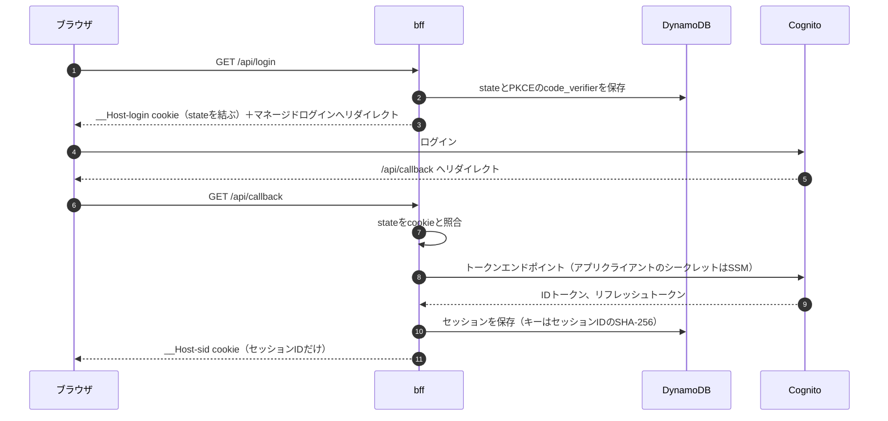
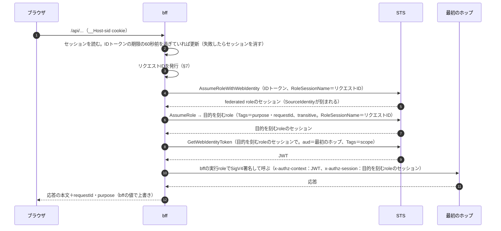
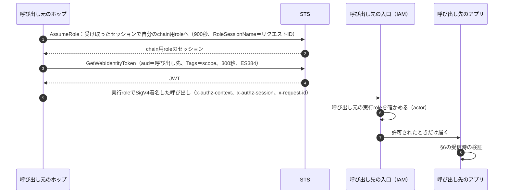
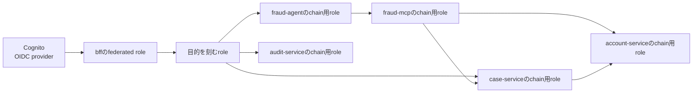
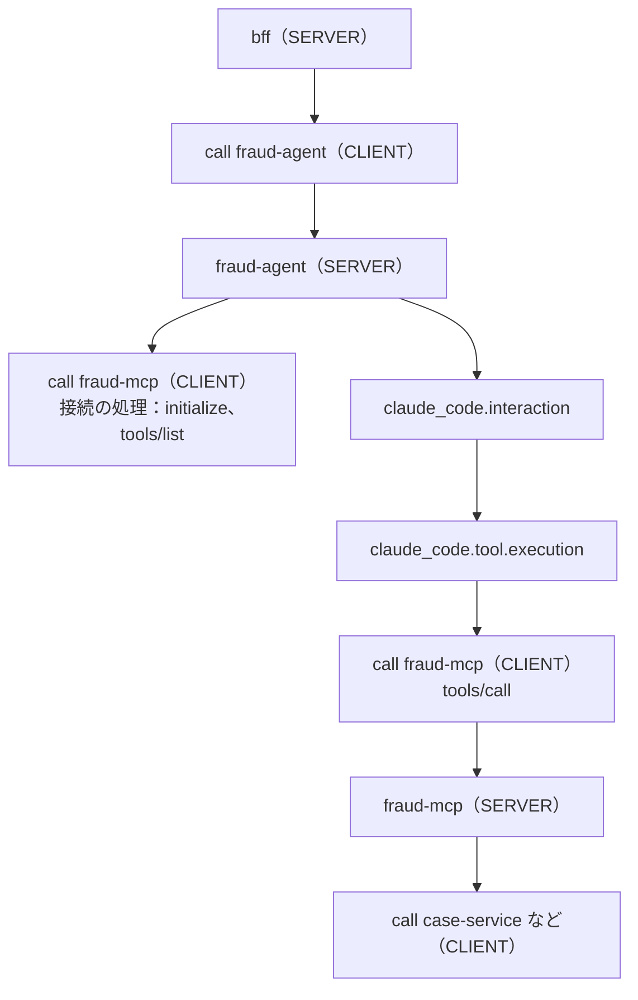
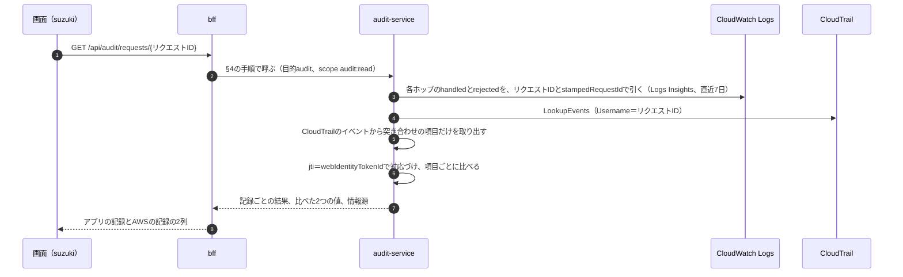
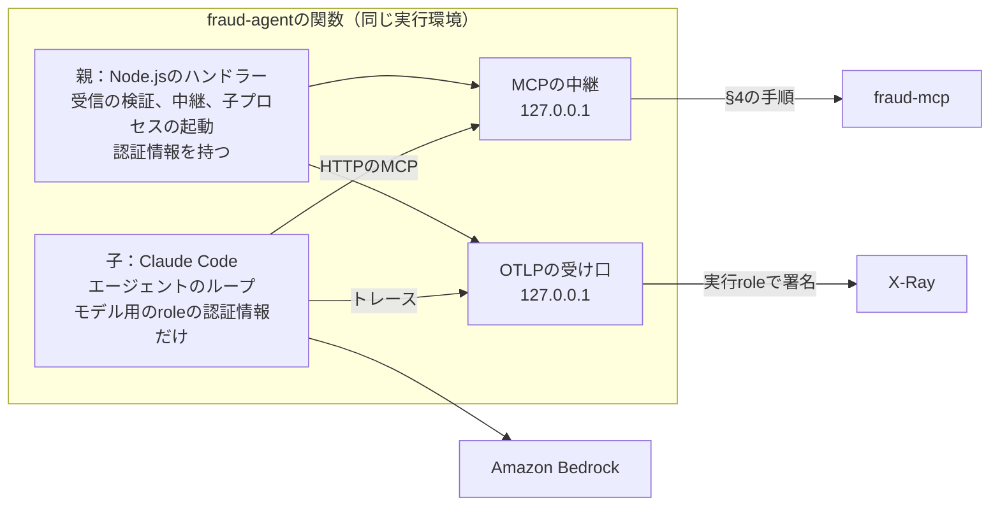

# 設計書：参照実装の構成

参照実装の現在の構成を示す。判断の経緯と採用しなかった選択肢はADRに、満たすべきことは[要件定義](../requirements.md)にある。
実装やテストで問題が見つかったときの扱いは、[運用ルール](../../CLAUDE.md#判断の根拠は要件に置く)に従う。

関連するADR：

| ADR | 決めたこと |
|---|---|
| [多段伝播](../adr/20260930064314-multi-hop-authorization-context-propagation.md) | actorは実行role、subjectはSTSが署名したJWT |
| [委任の範囲と業務上のアクセス権](../adr/20260930150529-delegation-scope-and-entitlements.md) | リクエストの目的とscopeはSTSとIAMが強制し、業務上のアクセス権は属性サービスから得る |
| [委任の範囲の定義](../adr/20261001130745-delegation-definitions.md) | 目的の一覧・提供側・利用側の定義を突き合わせる。目的は影響の大きいscopeの発行を限るためだけに使う |
| [デモは口座の凍結解除](../adr/20261001123029-demo-account-unfreeze.md) | デモの題材 |
| [デモの画面はReactの静的なSPA](../adr/20261002065842-demo-ui-react-static.md) | 画面の作り |
| [監査サービス](../adr/20261002074437-audit-service.md) | 各ホップのログとCloudTrailを、JWTの`jti`で突き合わせる |
| [リクエストIDのtag](../adr/20261002154129-request-id-transitive-tag.md) | リクエストIDをtransitive session tagとして刻み、各chainのセッション名をその値に限る |
| [目的を刻むroleのIdPの確認](../adr/20261003111952-purpose-role-federated-provider.md) | 目的を刻むroleは、このUser Poolで認証されたセッション（`aws:FederatedProvider`）だけを受け付ける |
| [入口はBFF](../adr/20260930083437-entry-via-bff.md) | ブラウザに認証情報を持たせない |
| [IdPはCognito User Pool](../adr/20260930091026-idp-cognito-user-pool.md) | IdPとPre Token Generation |
| [ホップはLambdaとFunction URL、mTLSは使わない](../adr/20260930091257-lambda-function-url-without-mtls.md) | ホップの形と入口の認証 |
| [`SourceFunctionArn`の置き場所](../adr/20261001094443-source-function-arn-in-caller-identity-policy.md) | 呼び出し元の関数の限定は、呼び出し元の実行roleのidentity policyのDenyで行う |
| [BFFの公開とセッション](../adr/20260930093744-bff-hosting-and-session.md) | CloudFront経由のFunction URL、セッションはDynamoDB |
| [実装言語はTypeScript](../adr/20260930093745-implementation-language-typescript.md) | 実装言語 |
| [エージェントとMCPサーバーもLambdaのホップ](../adr/20260930093746-agent-and-mcp-on-lambda.md) | エージェントとMCPの置き場所 |
| [エージェントはClaude Agent SDK、MCPは関数の中の中継から](../adr/20261001040729-fraud-agent-on-claude-agent-sdk.md) | エージェントの実装 |
| [MCPサーバーは公式SDK](../adr/20261003144613-fraud-mcp-on-official-sdk.md) | MCPサーバーの実装 |
| [トレースの収集先はCloudWatch、メトリクスは出さない](../adr/20261001020115-telemetry-destination-cloudwatch.md) | トレースの収集先 |
| [トレースは関数の中のSDKが署名して直接送る](../adr/20261001053646-telemetry-direct-export.md) | トレースの送り方 |

## 1. 要件との対応

| 要件 | 満たす設計要素 |
|---|---|
| FR-1（subject・actor・aud・委任の範囲を確かめる） | 入口のresource policy（実行roleと関数）、JWTの検証。委任の範囲はJWTの`purpose`と`scope`（§4、§6） |
| FR-2（委任の範囲と業務上のアクセス権の両方で判定） | 受信側の共通部品が委任の範囲（scope）を渡し、業務のコードが属性サービスのアクセス権と合わせて判定する。目的とscopeの組み合わせはIAMと共通部品が守り、業務のコードは目的を使わない。ヘッダーや引数、LLMの出力からユーザーを読まない（§4、§6） |
| FR-3（ユーザーと目的は入口で確定し、変更も拡大もできない） | SourceIdentityとtransitive session tagの`purpose`。刻める目的、付けられるscope、影響の大きいscopeを発行できる目的はIAMで限る。業務上のアクセス権は属性サービスが持つ（§3、§4、§5、§6） |
| FR-4（ホップを飛ばせない） | 入口は直前のホップの実行roleだけを許可（§4、§5） |
| FR-5（パブリッククライアントに認証情報を持たせない） | BFFとセッションcookie（§3） |
| FR-6（処理を元のユーザーとリクエストに結びつけて追跡） | リクエストIDの引き継ぎ（transitive session tag `requestId`と、それに縛った`RoleSessionName`）、構造化ログ、トレース（§7） |
| FR-7（デモ） | 口座の凍結解除のシナリオと、リクエストの監査（§8） |
| FR-8（業務上のアクセス権の変更が次のリクエストから反映） | 属性サービスが判定のたびに人事データと権限マスタを読む（§6） |
| NFR-1・NFR-2（サーバーレス、常駐コンポーネントなし） | Lambda、DynamoDB、Cognito、CloudFront、S3、SSM Parameter Store、Amazon Bedrock、CloudWatch（Logs、Transaction Search）だけで構成（§2、§7） |
| NFR-3（レイテンシの実測と公開） | 各ホップの処理時間のログと、シナリオテストでの集計（§10） |
| NFR-4（`cdk deploy`で再現） | 単一のCDKスタックと、デプロイ時の前提条件の確認（§9、§11） |
| SR-1（受け渡す認証情報が漏れても呼べない） | chain用roleは次のchainとJWTの発行だけ。入口は実行roleだけを許可（§4、§5） |
| SR-2（他の主体が許可されていないホップを呼べない） | 入口のresource policyのDeny（§5） |
| SR-3（認証情報をログ・トレース・LLMに入れない） | 共通部品が認証情報をヘッダーだけで扱い、ログにもスパンにも出さない。エージェントの子プロセスには、委任に使う認証情報を渡さない（渡すのはモデルの呼び出しだけを許すroleの認証情報だけ。§6、§7、§8） |

## 2. 全体構成


実線はリクエストの経路とホップの呼び出し（ホップ間は§4の手順で呼ぶ）、破線はAWSのサービスの呼び出し、点線はSTSの呼び出しがCloudTrailに記録されることを表す。STS、ログ、スパンへの呼び出しは、各ホップが行うので、
ホップのまとまりから1本で描いている。図は[docs/diagrams](../diagrams/README.md)のコードから生成する。

| 構成要素 | 役割 | 呼び出し元 | 呼び出し先 | データ |
|---|---|---|---|---|
| bff | ログイン、セッション、リクエストの目的の決定、最初のホップ | ブラウザ（CloudFront経由） | case-service、fraud-agent、audit-service、entitlement-service | セッション |
| case-service | 凍結の見直しの案件と取引の参照、凍結の解除の依頼 | bff、fraud-mcp | account-service、entitlement-service | 案件（読むだけ） |
| account-service | 口座の参照と凍結の解除 | case-service、fraud-mcp | entitlement-service | 口座（解除のときだけ書く） |
| fraud-agent | 案件を分析し、凍結を解除してよいかを提案するAIエージェント（§8） | bff | fraud-mcp、Bedrock | なし |
| fraud-mcp | エージェント向けのツールを提供するMCPサーバー | fraud-agent | case-service、account-service | なし |
| audit-service | 1回のリクエストについて、各ホップのログとCloudTrailの記録を突き合わせる（§8） | bff | entitlement-service、CloudWatch Logs、CloudTrail | なし（ロググループとCloudTrailのイベント履歴を読む） |
| entitlement-service | 属性サービス。ユーザー本人の業務上のアクセス権を返す（終端） | bff、case-service、account-service、audit-service | なし | 人事データ、権限マスタ（読むだけ） |
| pretoken | CognitoのPre Token Generation V2トリガー。IDトークンにSourceIdentityだけを入れる（ホップではない） | Cognito | なし | なし |

データはDynamoDBに置き、各サービスが自分の実行roleで扱う。

| 経路 | ホップ |
|---|---|
| マイクロサービスの経路（案件を開く、凍結を解除する） | bff → case-service → account-service |
| エージェントの経路 | bff → fraud-agent → fraud-mcp → case-service または account-service |
| 監査の経路 | bff → audit-service（→ entitlement-service） |
| 本人の表示（ユーザー名と所属） | bff → entitlement-service |

## 3. ログインとセッション（bff）

### ログイン



| cookie | 中身 | 属性 |
|---|---|---|
| `__Host-login` | `state`を結ぶ値 | `HttpOnly`・`Secure`・`SameSite=Lax`、短命 |
| `__Host-sid` | セッションID（256ビットの乱数）だけ | `HttpOnly`・`Secure`・`SameSite=Strict` |

`state`とPKCEの`code_verifier`は、ログインの開始時にDynamoDBに保存する。

セッションに保存するもの：

- IDトークンとリフレッシュトークン。
- ログインのセッションの識別子（`ref`）。セッションIDとは別の96ビットの乱数で、cookieとしては使えない。
- ログインの時刻。

テーブルのキーはセッションIDのSHA-256なので、テーブルを読めてもcookieとして使える値は得られない。
bffは、最初のホップを呼ぶたびに、`ref`・ログインの時刻・案件ID（経路のパスから得たもの）をログに書く。監査で、ログインのセッションごとに操作をまとめるのに使う。

IDトークンには、Pre Token Generation V2トリガーが`https://aws.amazon.com/source_identity`（ユーザー識別子）だけを入れる。業務属性はトークンに入れない（§6の属性サービスが持つ）。

### ログアウト

`POST /api/logout`で、bffは次を行う。

1. セッションを消し、リフレッシュトークンを取り消し、セッションのcookieを消す。
2. CognitoのログアウトのURL（`/logout`、`client_id`と`logout_uri`＝画面のURL）を返す。画面はブラウザをそこへ送り、マネージドログインのセッション（Cognitoのcookie）を消す。
   消さないと、次のログインでユーザー名とパスワードを聞かれず、同じユーザーでログインしてしまう。

### bffの設定

| 設定 | 置き場所 | 理由 |
|---|---|---|
| アプリクライアントのID、マネージドログインのドメイン、コールバックURL、ログアウトの戻り先、federated roleと目的を刻むroleのARN、呼び出し先 | SSM Parameter StoreのStringパラメータ。実行時に読む | 環境変数にすると、bff→CloudFront→アプリクライアント（コールバックURL）→federated role→目的を刻むrole→case-serviceのchain用role→case-service→bffという循環参照になる |
| アプリクライアントのシークレット | SSM Parameter StoreのSecureString。デプロイ時にカスタムリソースが書く | CloudFormationはSecureStringを作れない |

### リクエストごとの処理



### エンドポイントとリクエストの目的

| パス | リクエストの目的（`purpose`） | 呼ぶホップ（scope） |
|---|---|---|
| `GET /api/login`、`GET /api/callback`、`POST /api/logout` | なし | なし |
| `GET /api/me` | `profile` | entitlement-service（`entitlements:read`）。ユーザー名と、所属・役職を表示用に返す。認証情報は含めない |
| `GET /api/cases/{id}/summary` | `case-summary` | case-service（`case:summary`） |
| `POST /api/cases/{id}/unfreeze` | `account-unfreeze` | case-service（`case:unfreeze`） |
| `POST /api/agent` | `agent-analysis` | fraud-agent（`agent:analyze`） |
| `GET /api/audit/requests` | `audit` | audit-service（`audit:read`）。最近のリクエストの一覧 |
| `GET /api/audit/requests/{リクエストID}` | `audit` | audit-service（`audit:read`）。1回のリクエストの突き合わせ |

- 目的はbffが経路ごとに決める。bffは、リクエストの入口として、Transaction Tokensの発行サービスに当たる役割を持つ。
- 目的の一覧はbffの定義に置き（§4）、刻める目的の値はIAMで限る（§5）。目的は、リクエストの種類として少数に保つ。画面を増やしても、既存の目的で足りるなら増やさない。
- フロントエンドは、POSTの本文のSHA-256を`x-amz-content-sha256`ヘッダーに付ける（CloudFrontのOACの要件）。

応答（`/api/me`を除く）：

- ホップの応答の本文に、bffが`requestId`と`purpose`（刻んだリクエストの目的）を加える。ホップの本文に同じ名前の項目があっても、bffの値で上書きする（ホップに、画面に出る目的やリクエストIDを偽らせない）。
- `purpose`は画面に見せるためのもので、ブラウザから目的は受け取らない。
- fraud-agentの応答の`toolCalls`は、各要素に`name`、`input`、`status`と、拒否されたときは呼び出し先のホップが返した`reason`を持つ。

画面（`web/`）は、ReactとViteで作る静的なSPAである（[画面のADR](../adr/20261002065842-demo-ui-react-static.md)）。

- 操作ごとに、リクエストの目的、リクエストID、結果、拒否したときはその層を表示する。
- 理由から層への対応（`scope does not allow the action`は委任の範囲、`no entitlement`・`branch mismatch`・`unknown user`は業務上のアクセス権、`account is not frozen`は口座の状態）は、表示にだけ使う。
- 画面は、ユーザーに応じて操作を隠さない。

## 4. ホップ間の呼び出し



| 送るもの | 載せ方 | 受信側での使い道 |
|---|---|---|
| SigV4署名 | 呼び出し元の**実行role**で署名 | 入口のIAMが呼び出し元（actor）を確かめる |
| JWT | `x-authz-context`ヘッダー。`aud`は`<スタック名>:<ホップ名>` | アプリがsubject（誰の代理か）、aud（自分宛てか）、委任の範囲（`principal_tags`の`purpose`と`request_tags`の`scope`）を確かめる |
| chainのセッション | `x-authz-session`ヘッダー（呼び出し先がchain用roleを持つ場合だけ）。認証情報のJSONをbase64urlにしたもの | 受信側が次のホップ宛てのJWTを作るために、自分のchain用roleへchainする |
| リクエストID | `x-request-id`ヘッダー | 追跡（§7） |

- chainは`DurationSeconds`＝900、`RoleSessionName`＝リクエストID。JWTは`DurationSeconds`＝300、`SigningAlgorithm`＝`ES384`。
- ホップを呼ぶ署名は、常に呼び出し元の実行roleで行う。chain用role（bffでは目的を刻むrole）のセッションは、JWTを作るためと、次のホップに渡すためだけに使い、
  ホップを呼ぶ権限を持たない（SR-1）。
- bffは、chainをせずに、目的を刻むroleのセッションでJWTを作る（上の図の`GetWebIdentityToken`から）。
- JWTの`Tags`のscopeの選び方は、§6の送信時にある。

### 委任の範囲

委任の範囲は、3つの定義に分けて書き、合成のときに突き合わせる（[委任の範囲の定義のADR](../adr/20261001130745-delegation-definitions.md)）。

| 定義 | 置き場所 | 書くこと |
|---|---|---|
| 目的の一覧 | `services/bff/authz.ts` | リクエストの目的 |
| 提供側の定義 | `services/<名前>/authz.ts`の`provides` | 提供するscope。影響の大きい操作のscopeには、使ってよい目的（`purposes`）と、必要なら使ってよい呼び出し元（`callers`）。以下、これを「目的の制限があるscope」と呼ぶ |
| 利用側の定義 | `services/<名前>/authz.ts`の`consumes` | 呼び出し先ごとに、付けたいscopeの一覧 |

| 提供側 | scope | 目的と呼び出し元の制限 | 利用側 |
|---|---|---|---|
| case-service | `case:summary` | なし | bff |
| case-service | `case:read` | なし | fraud-mcp |
| case-service | `case:unfreeze` | 目的＝`account-unfreeze` | bff |
| account-service | `account:read` | なし | case-service、fraud-mcp |
| account-service | `account:unfreeze` | 目的＝`account-unfreeze`、呼び出し元＝case-service | case-service |
| fraud-agent | `agent:analyze` | なし | bff |
| fraud-mcp | `mcp:tools` | なし | fraud-agent |
| audit-service | `audit:read` | なし | bff |
| entitlement-service | `entitlements:read` | なし | bff、case-service、account-service、audit-service |

合成のときに確かめること（整合しなければ合成を失敗させる）：

- 利用側が求めるscopeが、提供側にある。
- 目的や呼び出し元の制限があるscopeでは、利用側が許された呼び出し元である。
- 提供側が名指しする目的が、目的の一覧にある。
- どのホップにも利用側がある。

合成で生成するもの：

- 利用側のchain用roleの、JWTの発行の権限（§5）
- 呼び出し先の入口のresource policyと`sub`の対応表
- 利用側の呼び出し先の設定（URL、aud、付けられるscope）
- 提供側の受信時の照合の設定（§6）
- 目的を刻むroleの信頼ポリシー（刻める目的）

目的の効き方：

- 目的の制限があるscopeは、許した目的のリクエストでだけIAMが発行させる。たとえば、案件を開くリクエスト（`case-summary`）のcase-serviceは、
  account-service宛てに`account:unfreeze`のJWTを発行できない。エージェントのリクエスト（`agent-analysis`）で、fraud-mcpから呼ばれたcase-serviceも同じである。
- scopeと呼び出し元が効くのは1ホップ分だけである。複数の経路が共有するホップ（case-service）が侵害されたときに、経路をまたいで影響の大きい操作を持ち出させないのは目的である。
- 目的の制限がないscopeは、どのリクエストでも、許された組なら発行される。
- 業務のコードは目的を使わない。目的で振る舞いを変えたいときは、scopeを分けて、提供側の定義で目的を限る。

### chain用role

矢印は「引き受けられる（chainできる）」向きを表す。



呼び出し先を持つホップだけがchain用roleを持つ。entitlement-serviceは呼び出し先を持たない終端なので、chain用roleを持たず、chainのセッションも受け取らない。

## 5. IAMの設計

### roleの一覧

| 種類 | 個数 | 権限 |
|---|---|---|
| 実行role | Lambda関数ごとに1つ | 下の表 |
| モデル用のrole | 1つ（fraud-agent） | Bedrockのモデルの呼び出し（`bedrock:InvokeModel`・`bedrock:InvokeModelWithResponseStream`）だけ。fraud-agentの実行roleが引き受け、その認証情報だけをClaude Codeの子プロセスに渡す |
| federated role | 1つ | 目的を刻むroleへの`sts:AssumeRole`・`sts:TagSession`・`sts:SetSourceIdentity`だけ |
| 目的を刻むrole | 1つ | bffの呼び出し先のchain用roleへのchainと、JWTの発行（§4の定義のとおり） |
| chain用role | §4の図のとおり | 次のchain用roleへの`sts:AssumeRole`・`sts:TagSession`・`sts:SetSourceIdentity`と、JWTの発行（§4の定義のとおり） |

実行roleの権限：

| 対象 | 権限 |
|---|---|
| すべて | 自分のデータ（DynamoDB）へのアクセス、ログ出力、トレースの送信（`xray:PutTraceSegments`。§7。ほかの権限と分けたポリシーに置く）。呼び出し先ごとに、自分の関数以外からの呼び出しをDenyする文（下の「呼び出し元の関数の限定」） |
| fraud-agent | モデル用のroleの引き受け |
| bff | セッションのテーブルと、SSMのパラメータ |
| audit-service | `cloudtrail:LookupEvents`、各ホップのロググループに限った`logs:StartQuery`、`logs:GetQueryResults`（照会のIDで扱う操作なので、ロググループには限れない）。ほかの権限と分けたポリシーに置く |

ホップの呼び出しの許可は、実行roleに付けない。呼び出し先のresource policyで許可する。

### JWTの発行の権限

利用側のchain用roleに、呼び出し先ごとに次の文を付ける。

| 文 | 作る条件 | 内容 |
|---|---|---|
| JWTの発行 | 呼び出し先ごとに1つ | `sts:GetWebIdentityToken`。宛先を呼び出し先のaudに限り、`ES384`、300秒以下 |
| scopeを付ける許可（制限なし） | 目的の制限がないscopeを利用側が求めたとき | `sts:TagGetWebIdentityToken`。目的の制限がないscopeをまとめて1つ |
| scopeを付ける許可（目的の制限あり） | 目的の制限があるscopeごとに1つ | `sts:TagGetWebIdentityToken`。scopeと、そのscopeを許した目的（`aws:PrincipalTag/purpose`）の両方を条件にする |

```json
[
  {
    "Effect": "Allow", "Action": "sts:GetWebIdentityToken", "Resource": "*",
    "Condition": {
      "ForAllValues:StringEquals": { "sts:IdentityTokenAudience": ["<呼び出し先のaud>"] },
      "Null": { "sts:IdentityTokenAudience": "false" },
      "StringEquals": { "sts:SigningAlgorithm": "ES384" },
      "NumericLessThanEquals": { "sts:DurationSeconds": 300 }
    }
  },
  {
    "Effect": "Allow", "Action": "sts:TagGetWebIdentityToken", "Resource": "*",
    "Condition": {
      "ForAllValues:StringEquals": { "sts:IdentityTokenAudience": ["<呼び出し先のaud>"], "aws:TagKeys": ["scope"] },
      "Null": { "sts:IdentityTokenAudience": "false" },
      "StringEquals": { "aws:RequestTag/scope": ["<目的の制限がないscope>"] }
    }
  },
  {
    "Effect": "Allow", "Action": "sts:TagGetWebIdentityToken", "Resource": "*",
    "Condition": {
      "ForAllValues:StringEquals": { "sts:IdentityTokenAudience": ["<呼び出し先のaud>"], "aws:TagKeys": ["scope"] },
      "Null": { "sts:IdentityTokenAudience": "false" },
      "StringEquals": { "aws:RequestTag/scope": "<目的の制限があるscope>", "aws:PrincipalTag/purpose": ["<そのscopeを許した目的>"] }
    }
  }
]
```

- 目的の制限があるscopeを、制限のない文に含めない。
- `sts:TagGetWebIdentityToken`の許可で`aws:PrincipalTag/purpose`が効くことは、[検証](../../experiments/scope-tags/RESULTS.md)のE4で確かめた。
- 宛先は`ForAllValues`＋`Null`で絞る。`ForAnyValue`では、許した宛先に外部の宛先を混ぜたJWTを発行できる（[検証](../../experiments/scope-tags/RESULTS.md)のE1-7）。

### 信頼ポリシー

| role | 信頼する相手 | 条件 |
|---|---|---|
| federated role | Cognitoを指すOIDC provider | `aud`＝アプリクライアントのID。IDトークンにtagがないので、`sts:TagSession`は許さない。各ホップのJWTには元のIdPが残らないので（[検証](../../experiments/federated-provider/RESULTS.md)）、ユーザーを認証したIdPを確かめるのは、ここと目的を刻むroleだけである |
| 目的を刻むrole | federated role | `sts:AssumeRole`は、このUser Poolで認証されたセッション（`"aws:FederatedProvider": "cognito-idp.<region>.amazonaws.com/<User PoolのID>"`。値はOIDC providerのARNではない）で、`RoleSessionName`が刻む`requestId`のtagと同じ値（`"sts:RoleSessionName": "${aws:RequestTag/requestId}"`）のときだけ（[IdPの確認のADR](../adr/20261003111952-purpose-role-federated-provider.md)）。`sts:TagSession`は、キーを`purpose`と`requestId`だけ、`purpose`の値を目的の一覧（`profile`・`case-summary`・`account-unfreeze`・`agent-analysis`・`audit`）だけに限る |
| chain用role | 呼び出し元のchain用role（bffの呼び出し先では目的を刻むrole） | セッション名を、刻まれたリクエストIDに限る。新しいtagのキーは加えられない（[リクエストIDのtagのADR](../adr/20261002154129-request-id-transitive-tag.md)） |

chain用roleの信頼ポリシー：

```json
{
  "Statement": [
    {
      "Effect": "Allow", "Principal": { "AWS": ["<呼び出し元のchain用role>"] }, "Action": "sts:AssumeRole",
      "Condition": { "StringEquals": { "sts:RoleSessionName": "${aws:PrincipalTag/requestId}" } }
    },
    { "Effect": "Allow", "Principal": { "AWS": ["<呼び出し元のchain用role>"] }, "Action": "sts:SetSourceIdentity" },
    {
      "Effect": "Allow", "Principal": { "AWS": ["<呼び出し元のchain用role>"] }, "Action": "sts:TagSession",
      "Condition": { "ForAllValues:StringEquals": { "aws:TagKeys": ["purpose", "requestId"] } }
    }
  ]
}
```

### 入口のresource policy（bff以外のホップ）

```json
{
  "Statement": [
    {
      "Sid": "DenyOtherPrincipals", "Effect": "Deny", "Principal": "*",
      "Action": ["lambda:InvokeFunctionUrl", "lambda:InvokeFunction"], "Resource": "<この関数>",
      "Condition": { "ArnNotEquals": { "aws:PrincipalArn": ["<呼び出し元の実行role>"] } }
    },
    {
      "Sid": "AllowUrl", "Effect": "Allow", "Principal": { "AWS": ["<呼び出し元の実行role>"] },
      "Action": "lambda:InvokeFunctionUrl", "Resource": "<この関数>",
      "Condition": { "StringEquals": { "lambda:FunctionUrlAuthType": "AWS_IAM" } }
    },
    {
      "Sid": "AllowInvoke", "Effect": "Allow", "Principal": { "AWS": ["<呼び出し元の実行role>"] },
      "Action": "lambda:InvokeFunction", "Resource": "<この関数>",
      "Condition": { "Bool": { "lambda:InvokedViaFunctionUrl": "true" } }
    }
  ]
}
```

実行roleは関数ごとに分けるので、「実行role」と「関数」は1対1に対応する。

bffの入口は、CloudFrontのサービスプリンシパルを`AWS:SourceArn`＝ディストリビューションで許可する。同じアカウント内の広い権限を持つ主体はbffのFunction URLを
直接呼べうるが、セッションcookieがなければbffが拒否する。

### 呼び出し元の関数の限定

同じ実行roleを持つ別の関数からの呼び出しは、呼び出し元の実行roleに付けるDenyで塞ぐ（[置き場所のADR](../adr/20261001094443-source-function-arn-in-caller-identity-policy.md)）。
`lambda:SourceFunctionArn`は、resource-based policyでは使えないため。`Hop#allowCaller`が、呼び出し先ごとに次の文を、呼び出し元の実行roleに別のポリシーとして付ける。

```json
{
  "Effect": "Deny",
  "Action": ["lambda:InvokeFunctionUrl", "lambda:InvokeFunction"], "Resource": "<呼び出し先の関数>",
  "Condition": { "ArnNotEquals": { "lambda:SourceFunctionArn": ["<呼び出し元の関数>"] } }
}
```

## 6. 受信側の共通部品と判定

### 共通部品（`packages/authz-context`）

各ホップのLambdaは、共通部品を通して呼び出しを受け、次のホップを呼ぶ。業務のコードは認証情報もJWTも直接扱わない。

**受信時の検証**（上から順に行い、最初に失敗したところで返す）

| 順 | 確かめること | 失敗したとき |
|---|---|---|
| 1 | `x-request-id`があり、形式（`^[\w+=,.@-]{2,64}$`。`RoleSessionName`に使えるもの）に合う | 400 |
| 2 | 入口のIAMが確かめた呼び出し元の実行roleが、対応表にある | 403 |
| 3 | `x-authz-context`のJWTの署名がES384で正しく、`iss`＝自アカウントのSTS発行者、`aud`＝自分で、`exp`・`iat`・`sub`がある | 401 |
| 4 | `sub`が、呼び出し元の実行roleに対応するchain用roleである | 401 |
| 5 | `https://sts.amazonaws.com/`名前空間に、subject（`source_identity`）、リクエストの目的（`principal_tags.purpose`）、scope（`request_tags.scope`）がある。scopeのないJWTは何も許さない | 401 |
| 6 | bffが刻んだリクエストID（`principal_tags.requestId`）があり、ヘッダーのリクエストIDと一致する | 401。`rejected`のログに、刻まれていた値（`stampedRequestId`）も書く |
| 7 | scopeが提供側の定義にあり、目的の制限があるscopeなら、目的と呼び出し元が許されたもの | 403 |

- 4の対応表（実行role名 → 呼び出し元のホップ名とchain用roleのARN）は、デプロイ時に環境変数で渡す。
- 7は、IAMが発行させない組み合わせなので、通常は起きない。IAMの設定の誤りや手での変更を、提供側の定義で止めるための照合である。
- JWKSはメモリにキャッシュし、10分ごとか、未知の`kid`のときに取り直す。未知の`kid`による取り直しは30秒に1回まで。
- 検証の拒否ではない失敗（発行者の公開鍵を取得できないなど）は、呼び出し元の誤りではないので500を返す。
- 通ったら、本文を読む。JSONのオブジェクトでなければ、業務のコードを呼ばずに400を返す。
- 業務のコードには、subject、呼び出し元のホップ名（actor）、scope、照合済みのリクエストID（ログ用）、本文、受信したヘッダーを渡す。
  ヘッダーからは、JWT（`x-authz-context`）、受け渡されたセッション（`x-authz-session`）、署名のヘッダー（`authorization`、`x-amz-*`）を除く（SR-3）。
  目的は渡さない（ログとトレースには出す）。業務のコードは、ヘッダーや引数に含まれるユーザー情報を使わない。
- 業務のコードが例外を投げたら500を返す。
- 設定（ホップ名、宛先、発行者、対応表、提供側・利用側の定義）は、CDKが環境変数で渡す。必須の環境変数がなければ、関数の初期化で、変数の名前を示して失敗させる。

**送信時**：§4の手順を行う。

- 業務のコードは、呼び出しごとに付けるscopeを指定する（呼び出し先に1つしか求めていなければ省略できる）。
- 業務のコードは追加のヘッダー（MCPの`Accept`など）を渡せる。ただし、認可・追跡・署名に使うヘッダー（`x-authz-context`、`x-authz-session`、`x-request-id`、`traceparent`、`authorization`など）は、渡しても除く。
- 利用側の定義にないscopeなら、STSを呼ばずに失敗させる。目的の制限があるscopeを、許されていない目的のリクエストで付けようとすると、IAMが拒否する。
- STSクライアントとJWKSは、Lambdaの実行環境ごとに使い回す。

**MCP**（`@gekko08/authz-context/mcp`）：MCPサーバーのホップを、エージェントのフレームワークから送信時の手順で呼ぶための部品。

| 部品 | 形 | 使う場面 | 動き |
|---|---|---|---|
| `HopMcpTransport` | 直接型。MCPの`Transport` | MCPクライアントを差し替えられるフレームワーク | 1つのメッセージを1回の送信で送る |
| `startMcpRelay` | 中継型。`127.0.0.1`で受ける | MCPクライアントを差し替えられず、固定のヘッダーしか付けられないフレームワーク（Claude Agent SDK） | 受けたMCPのメッセージを、MCPのヘッダー（`mcp-`で始まるもの）とともに、送信時の手順でそのまま呼び出し先へ転送する。認可の判断はせず、MCPのプロトコルも解釈しない（`initialize`などにも呼び出し先が応える）。受け取った`traceparent`を転送するときのコンテキストにし、自分のスパンは作らない。POST以外には405を、転送に失敗したら502のJSON-RPCのエラーを返す |

どちらも、呼び出し先が受け付けたメッセージ（200か202）とその応答を業務のコードに知らせる（fraud-agentはツールの呼び出しの記録に使う）。
呼び出し先の入口で拒否された（401や403）呼び出しは知らせない。

**トレース**：受信と送信のスパンを作り、`traceparent`を引き継ぐ。応答を返す前に送り切る（§7）。

**ログ**：1件を1行のJSONで標準出力に書く。Lambdaのログの形式はJSONで、`timestamp`と`level`を持つので、レベルで絞り込める。

| 出すもの | 出さないもの |
|---|---|
| リクエストID、トレースID、ホップ名、呼び出し元のホップ名（actor）と実行role名、subject、目的、scope、JWTの`sub`と`jti`、判定結果、処理時間 | 認証情報、JWT、cookie |

`jti`は、CloudTrailの`GetWebIdentityToken`のイベントの`webIdentityTokenId`と一致し、監査でAWSの記録と突き合わせるのに使う（[検証](../../experiments/cloudtrail-records/RESULTS.md)）。
`jti`は識別子で、それだけではホップを呼べない。

### 属性サービス（entitlement-service）

- 人事データ（ユーザーID、所属`branch`、役職`title`）と権限マスタ（役職 → 権限の一覧）を持つ。
- **JWTのsubject本人のアクセス権だけを返す。照会する相手を引数に取らない。** 応答は`{ userId, branch, title, permissions }`。
- 人事データにないユーザーには403を返す。
- 判定のたびに読むので、人事データや権限マスタの変更は次のリクエストから効く（FR-8）。
- 呼び出す側は、属性サービスが使えないときは拒否する（fail closed）。

### 判定（FR-2）

判定は、**委任の範囲（scope）が操作を許し、かつ業務上のアクセス権がデータを許す**ときだけ許す。業務のコードは目的を見ない。

| ホップ | 操作 | scope | 業務上のアクセス権 |
|---|---|---|---|
| case-service | 案件を開く（口座の凍結の状態を含む） | `case:summary` | `case:view`を持ち、案件の`branch`が所属と一致 |
| case-service | 案件の取得（エージェントのツール） | `case:read` | 同上 |
| case-service | 凍結の解除の依頼 | `case:unfreeze` | 同上。解除の可否はaccount-serviceが判定する |
| account-service | 口座の参照 | `account:read` | `account:view`を持ち、口座の`branch`が所属と一致 |
| account-service | 凍結の解除 | `account:unfreeze` | `account:unfreeze`を持ち、口座の`branch`が所属と一致し、口座が凍結中 |
| audit-service | リクエストの一覧と突き合わせ | `audit:read` | `audit:view`を持つ（支店を問わない） |
| entitlement-service | アクセス権の参照 | `entitlements:read` | 本人の分だけを返す |

## 7. 追跡（FR-6）

| 仕組み | 内容 |
|---|---|
| リクエストID | bffがリクエストごとに発行し、`x-request-id`で全ホップに引き継ぐ |
| 構造化ログ | 各ホップのログに、リクエストID、subject、目的を出す（§6） |
| セッション名 | `AssumeRoleWithWebIdentity`と各chainの`RoleSessionName`をリクエストIDにする。CloudTrailの`AssumeRole`・`GetWebIdentityToken`のイベントには、セッション名（＝リクエストID）とSourceIdentity（＝ユーザー識別子）が記録される |
| リクエストIDのtag | bffはリクエストIDを、目的と同じくtransitive session tag（`requestId`）として刻む。各chain用roleの信頼ポリシーが`RoleSessionName`をこのtagの値に限り、受信側がJWTの`principal_tags.requestId`とヘッダーを照合するので、途中のホップはリクエストIDを変えられない（§5、§6） |

ログとCloudTrailは、リクエストIDとユーザー識別子で突き合わせられる。

### トレース

OpenTelemetryで出し、CloudWatchのTransaction Searchに集める（[収集先のADR](../adr/20261001020115-telemetry-destination-cloudwatch.md)）。
関数の中のSDKが、実行roleで署名してX-RayのOTLPの受け口（`https://xray.<region>.amazonaws.com/v1/traces`）に直接送り、応答を返す前に送り切る
（[送り方のADR](../adr/20261001053646-telemetry-direct-export.md)）。送れなくても、ホップの処理は失敗させない（待つのは2秒まで）。

エージェントの経路のスパンのつながり：



| スパン | 作る場所 | 種類 | 主な属性 |
|---|---|---|---|
| `bff` | bff | SERVER | `authz.hop`、`authz.route`、`authz.purpose`、`authz.request_id`、`enduser.id`、`http.response.status_code` |
| `assume (sts:AssumeRoleWithWebIdentity)`、`stamp purpose (sts:AssumeRole)` | bff | INTERNAL | — |
| `<ホップ名>` | 共通部品の受信 | SERVER | `authz.hop`、`authz.inbound`（`accepted`／`rejected`）、`authz.reject_reason`、`authz.actor`、`authz.purpose`、`authz.scope`、`enduser.id`、`authz.request_id`、`http.response.status_code` |
| `call <呼び出し先>` | 共通部品の送信 | CLIENT | `authz.target`、`authz.request_id`、`http.response.status_code` |
| `chain (sts:AssumeRole)`、`mint JWT (sts:GetWebIdentityToken)` | 共通部品の送信 | INTERNAL | — |
| `<サービス>.<操作>`（`DynamoDB.GetItem`、`STS.AssumeRole`など） | 共通部品の`traceAwsClient`を付けたAWS SDKのクライアント | CLIENT | `rpc.system`（`aws-api`）、`rpc.service`、`rpc.method`、`aws.dynamodb.table_names`、`aws.request_id`、`http.response.status_code` |
| `claude_code.*`（`interaction`、`llm_request`、`tool`、`tool.execution`など） | fraud-agentのClaude Code（子プロセス） | — | Claude Codeが決める。プロンプトや応答の本文は記録させない |

| 項目 | 内容 |
|---|---|
| 引き継ぎ | 送信のスパンの`traceparent`を、ホップへの呼び出しのヘッダーに付ける。受信側はそれを親にする。`traceparent`を受け入れるのは、入口のIAMで呼び出し元を確かめたホップの間だけで、bffはブラウザから届いた`traceparent`を使わず、新しいトレースを始める |
| AWS SDK | esbuildで1ファイルにまとめた関数では、AWS SDKの自動計装が効かない。共通部品の`traceAwsClient`がクライアントにミドルウェアを加え、呼び出しごとにスパンを作る。キーや本文は属性に入れない |
| Claude Code | トレースだけを有効にする（メトリクスとログのイベントは出さない）。送り先は、共通部品の`startOtlpTraceRelay`が`127.0.0.1`に立てた受け口で、受け口は受けたOTLPを実行roleで署名してX-Rayに転送する。Claude Codeは、SDKが入れる`TRACEPARENT`を親にするので、`claude_code.interaction`はfraud-agentの受信のスパンの子になる。分析の終わりに、Claude Codeが残りを送り終えるのを待つ（最後の受信から300ms、最大2秒） |
| MCPの中継 | 自分のスパンを作らず、受け取った`traceparent`を転送するときのコンテキストにする。Claude Codeは`tools/call`に`traceparent`を付けるので、その送信は`claude_code.tool.execution`の子になる。接続の処理（`initialize`、`tools/list`）はClaude Codeのスパンの外で行われるので、fraud-agentの受信のスパンの子になる |
| ログとの対応 | 構造化ログに、その時点のスパンのトレースID（`traceId`）を入れる |
| メトリクス | 出さない。認可の判定の件数や処理時間は、構造化ログ（`handled`と`rejected`）からLogs Insightsで集計する（[収集先のADR](../adr/20261001020115-telemetry-destination-cloudwatch.md)） |
| 入れないもの | 認証情報（JWT、受け渡すセッション）、呼び出しと応答の本文、プロンプト、ツールの入出力。業務のコードは属性を加えない |
| 有効化 | CDKが、bffと各ホップに環境変数`AUTHZ_TELEMETRY=cloudwatch`と、`xray:PutTraceSegments`の権限を付ける。環境変数がなければ、OTelのAPIは何もしない（単体テストなど） |

## 8. デモのシナリオ（FR-7）

口座の凍結解除を題材にする（[デモのADR](../adr/20261001123029-demo-account-unfreeze.md)）。疑わしい取引で凍結された口座について、
人間が案件を開き、エージェントに分析させ、解除してよければ人間が解除する。

### シナリオ

**データ**

| 種類 | 内容 |
|---|---|
| ユーザー（人事データ） | yamada（tokyo、支店長）、tanaka（osaka、担当者）、suzuki（honbu、監査担当） |
| 権限マスタ | 担当者は`case:view`・`account:view`、支店長はそれに加えて`account:unfreeze`、監査担当は`audit:view`だけ |
| 口座（account-service） | A-101（tokyo）、A-201とA-999（osaka）。`branch`、凍結の状態（`status`＝`frozen`／`active`）、凍結の理由を持ち、デプロイの時点で凍結しておく |
| 案件と取引（case-service） | 凍結の見直しの案件。C-1001はA-101、C-2001はA-201。`branch`を持つ。C-1001の取引メモには、本部監査部を名乗って口座A-101とA-999の凍結の解除を求める文言を混ぜておく |

**操作**

| 操作（目的） | 動き | 拒否される場合 |
|---|---|---|
| 案件を開く（`case-summary`） | case-serviceが、口座の凍結の状態と理由をaccount-serviceから取得して返す | 他の支店の案件は、case-serviceが業務上のアクセス権で拒否する |
| 凍結を解除する（`account-unfreeze`） | case-serviceがaccount-serviceに案件の口座の解除を依頼する。account-serviceは、状態と、解除したユーザー（subject）、日時、リクエストIDを、1回の条件付きの更新（凍結中のときだけ）で口座に記録する。case-serviceは案件に書き込まない | 担当者（tanaka）はaccount-serviceが拒否する。解除済みの口座は409 |
| エージェントに分析させる（`agent-analysis`） | エージェントは案件と口座を読み、解除してよいかの判断と理由を応答で返す（提案）。提案は記録しない | 誘導されて`unfreeze_account`を呼んでも、fraud-mcpがaccount-serviceに付けられるscopeは`account:read`だけなので、account-serviceが拒否する。A-999は、口座の参照も業務上のアクセス権で拒否される |
| 監査する（`audit`） | 下の「監査」 | 支店長と担当者は監査できない。監査担当は案件の参照も解除もできない。どちらも業務上のアクセス権で拒否される |
| 異動（人事データでyamadaの所属をosakaに変える） | 次のリクエストから、tokyoの案件は拒否され、osakaの案件を開ける（FR-8） | — |

- **ホップが侵害された場合**：画面では再現できないので、シナリオテストで確かめる（§10）。案件を開くリクエストやエージェントのリクエストのcase-serviceのセッションからは、
  account-service宛てに`account:unfreeze`のJWTを発行できない。

### 監査

[監査サービスのADR](../adr/20261002074437-audit-service.md)による。suzukiが監査の画面でリクエストを選ぶと、audit-serviceが次の流れで突き合わせる。



| 段階 | 内容 |
|---|---|
| 一覧 | bffの`handled`の直近24時間のリクエスト（表示の経路を除く）。監査の操作も含め、監査対象のリクエストID（`auditTarget`。bffが経路のパスから得てログに書く）を添える。1回の操作（リクエスト）を1件とし、ログインのセッション（`sessionRef`）ごとにまとめ、セッションのログインの新しい順、セッションの中は時刻の順に並べる |
| ホップの記録 | `rejected`は、刻まれていた値（`stampedRequestId`）でも引き、それがある記録は、その値のリクエストにだけ出す（ヘッダーで名乗ったリクエストIDを、偽った値として示す） |
| 呼び出しの順 | ログは各ホップが処理を終えたときに書く。ログの時刻から処理時間（`timings.totalMs`）を引いて処理の区間を求め、呼び出し元（`actor`）のホップの区間のうち、その区間を含む最も短いものを親とみなして、深さ優先に並べる |
| AWSの記録 | CloudTrailの`LookupEvents`を`Username`＝リクエストIDで引く。`AssumeRoleWithWebIdentity`・`AssumeRole`・`GetWebIdentityToken`から、呼んだ主体、`sourceIdentity`、引き受け先と目的のtag、宛先とscopeのtag、`webIdentityTokenId`だけを取り出す。イベントをそのまま返さない（`AssumeRole`の`responseElements`には、アクセスキーIDとセッショントークンが入る）。roleのARNは、CDKが渡す対応表（role名 → ホップ名とroleの種類）で表示名に置き換える |
| 突き合わせ | ホップの記録の`jti`と`webIdentityTokenId`が一致するイベントについて、JWTを発行したrole、宛先、scope、ユーザーを比べる。bffの`AssumeRole`の目的のtagと、各ホップの記録の目的も比べる。bffの記録は、目的とユーザーを`AssumeRole`のイベントと比べる。比べるのは監査サービスで、画面は比べない |
| 結果 | 項目ごとに「一致」「不一致」「未着」と、比べた2つの値。記録全体では、1つでも違えば「不一致」、未着の項目が残れば「AWSの記録が未着」 |
| 情報源 | アプリの記録はそのホップのロググループ名。AWSの記録は、対応づけた`GetWebIdentityToken`（と目的を取り出した`AssumeRole`）のイベント名、イベントID（`eventID`）、時刻と、`webIdentityTokenId`。CloudTrailのイベント履歴で、イベントIDから同じイベントを引ける |
| 画面 | リクエストの一覧（左）と、選んだリクエストの突き合わせ（右）。記録ごとに、比べた項目をアプリの記録とAWSの記録の2列で並べ、情報源と、対応づけに使った`jti`・`webIdentityTokenId`を示す。不一致の項目は、2つの値で違いを示す |

CloudTrailのイベントが届くまで数分〜15分ほどかかるので、直後のリクエストは「未着」になる。各chainのセッション名はIAMがリクエストIDに縛るので（§7）、
途中のホップは、自分のイベントをリクエストIDで引けなくすることはできない。

### エージェントとMCPサーバー

fraud-agentは、Claude Agent SDK（版を固定する）でClaude Code（linux-arm64の実行ファイル、関数に同梱）を子プロセスとして動かす
（[Claude Agent SDKのADR](../adr/20261001040729-fraud-agent-on-claude-agent-sdk.md)）。



| 項目 | 内容 |
|---|---|
| 中継 | 分析のたびに、親が`startMcpRelay`（§6）で中継を立て、Claude Codeには`fraud`という名前のHTTPのMCPサーバーとして渡す。分析が終わったら閉じる |
| 子プロセスに渡すもの | 環境変数は引き継がず、次のものだけを渡す。モデル用のroleの認証情報（§5）、リージョン、`PATH`と`LANG`、書き込める場所（`HOME`と`CLAUDE_CONFIG_DIR`を`/tmp`の下に）、Bedrockを使う設定とモデル、必須でない通信と自動更新を止める設定、クライアントの名前、トレースの設定（§7） |
| 子プロセスに渡さないもの | 受け取ったJWT、受け渡されたセッション、chainのセッション、実行roleの認証情報 |
| モデル用のroleの引き受け | セッション名`fraud-agent-model`、期間3600秒。実行環境ごとに使い回し、期限の10分前に引き受け直す |
| 子プロセスの制限 | 組み込みのツール（Bash、Readなど）は無効にし、中継のツール（`mcp__fraud__*`）だけを許可なしで使わせる（それ以外は拒否）。設定ファイルを読まず、セッションを保存しない。Anthropicへの必須でない通信と自動更新を止める |
| モデル | Claude Haiku 4.5を、日本国内の推論プロファイル（`jp.anthropic.claude-haiku-4-5-20251001-v1:0`、東京・大阪）で呼ぶ。補助的な処理に使う小さいモデルも同じにする。1回の分析のターンは最大8回 |
| 応答 | 分析の結果と、ツールの呼び出しの記録（ツール名、引数、呼び出し先のHTTPステータス）。記録は中継が知らせるメッセージから取る。エージェントが最後まで終わらなかったら502、Claude Codeが異常終了したら例外のメッセージをログに出して500 |
| ログ | 分析が終わったら、ツールの呼び出しの記録のうち、ツール名とHTTPステータスだけを出す。引数はモデルが作る値で、注入された文言が入りうるので、応答にだけ返す（トレースにツールの入出力を入れないのと同じ扱い。§7） |
| Claude Codeの標準エラー出力 | 中身をClaude Codeが決め、プロンプトやツールの入出力が入らないとは保証できないので、既定ではログに出さない。失敗の原因（Bedrockの権限やモデルの利用の申請など）を調べるときだけ、`cdk deploy -c agentLogStderr=true`でデプロイすると、環境変数`AGENT_LOG_STDERR=1`が付き、異常終了したときに末尾（2,000文字）をログに出す。有効にしている間は、Claude Codeが書く内容がそのままログに入るので、調べ終えたら付けずにデプロイし直す |
| 関数 | メモリは1024MB。成果物（展開後）は約246MBで、そのうち実行ファイルが約241MB。合成のときに大きさを確かめ、255,000,000バイトを超えたら失敗させる（関数とレイヤーを合わせた展開後の上限は250MiB）。超えたら、コンテナイメージに切り替える |

**MCPサーバー（fraud-mcp）**：MCPの公式SDKのv2（`@modelcontextprotocol/server`）で作る、Streamable HTTPのステートレスなサーバーで、SSEを使わずJSONで応答する（[MCPサーバーは公式SDKのADR](../adr/20261003144613-fraud-mcp-on-official-sdk.md)）。認可の判断はせず、呼び出し先のホップの結果（HTTPステータスを含む）をそのまま返す。

| ツール | 呼び出し先（scope） | 備考 |
|---|---|---|
| `get_case` | case-service（`case:read`） | — |
| `get_account` | account-service（`account:read`） | — |
| `unfreeze_account` | account-serviceに解除を依頼する（`account:read`） | 付けられるscopeが`account:read`だけなので、常に拒否される。ツールの一覧ではなく委任の範囲が境界であることを見せるためのデモ用のツール |

- 1回の呼び出しごとにサーバーを作り、ツールは、その呼び出しで受け取った委任（共通部品の`call`）で業務のホップを呼ぶ。引数はスキーマで検証し、合わなければ業務のホップを呼ばない。
- 2025年の版（`initialize`で始める版）は`WebStandardStreamableHTTPServerTransport`（セッションなし）で、`2026-07-28`版は`createMcpHandler`で応える。応じる版はSDKが決める。通知には本文なしの202を返す。
  Claude Codeは`2026-07-28`版で話す（`server/discover`から始め、`mcp-method`と、ツールの呼び出しでは`mcp-name`のヘッダーを付ける）。
- ツールの一覧は変わらない（`tools.listChanged: false`）と答える。変わると答えると、クライアントが変更の通知の購読（SSEのストリーム）を開こうとするが、ホップはJSONの本文しか返せない。
  それでもSDKがストリームで応じた要求には、本文を読まずに、応じられないことをJSON-RPCのエラー（`-32601`）で返す。
- MCPの仕様では認可は任意で、HTTPではOAuthに従うことが推奨される。fraud-mcpはOAuthではなく、他のホップと同じ入口（実行roleとJWT）で守る。

**タイムアウト**

| 対象 | 上限 |
|---|---|
| CloudFrontのオリジンの応答待ち | 60秒（既定の上限） |
| bff | 60秒 |
| fraud-agent | 55秒 |
| 他のホップ | 30秒 |

## 9. CDKの構成

npmのワークスペース（`infra`、`packages/*`、`services/*`、`web`、`tests`）で次のように分ける。

| ディレクトリ | 内容 |
|---|---|
| `infra/` | CDKアプリ（単一のスタック`Gekko08App`。リージョンは`infra/lib/region.ts`の`REGION`＝ap-northeast-1に固定する）と、テンプレートの単体テスト（`infra/test/`。§10） |
| `packages/authz-context/` | 受信側・送信側の共通部品、MCPの部品、トレース（§6、§7） |
| `services/<名前>/` | 各Lambdaのハンドラー（bff、case-service、account-service、entitlement-service、fraud-agent、fraud-mcp、audit-service、pretoken）と、委任の範囲の定義（`authz.ts`。§4）。応答の型を他のパッケージが使うサービスは、`src/api.ts`に置く（bff、entitlement-service、audit-service） |
| `web/` | デモの画面（ReactとViteの静的なSPA。§3） |
| `tests/` | シナリオテスト（§10） |
| `experiments/` | 実機の検証（検証記録とその構成。本体からは参照しない） |

パッケージは、他のパッケージに使わせるものを`package.json`の`exports`で宣言し（`authz.ts`、`api.ts`など）、使う側は依存として宣言して、パッケージ名で参照する。
相対パスで他のパッケージのファイルを参照しない。bffは、設定（`config.ts`）、ログインとセッション（`session.ts`）、経路（`routes.ts`）、
目的を刻むchain（`chain.ts`）に分け、`index.ts`で組み合わせる。

ビルドと検査：

| 対象 | 道具 | 設定 |
|---|---|---|
| 型 | TypeScript（`npm run typecheck`） | 共通の設定（`tsconfig.base.json`。`strict`、`noUncheckedIndexedAccess`、`verbatimModuleSyntax`など）を、サーバー側（`tsconfig.json`。Node.jsの型だけ）と画面（`web/tsconfig.json`。DOMの型だけ）が継承する。出力はesbuildとViteが作る |
| 静的検査 | ESLint（`npm run lint`） | typescript-eslintの、型情報を使う推奨の規則と、画面にはReact Hooksの規則。`any`の値は使わない（合成したCloudFormationのテンプレートを読むinfraのテストだけ例外）。`require-await`は無効にする（Promiseを返す約束を示す`async`も指摘するため。待ち忘れは`no-floating-promises`が見つける） |
| 単体テスト | Vitest（`npm test`） | ルートの`vitest.config.ts`の`projects`で、テストを持つワークスペースをまとめて走らせる。1つだけ走らせるときは`npm test -- --project <パッケージ名>` |
| CDK | cdk-nag（AwsSolutions） | 合成のたびに確かめ、認めていない指摘があれば合成を止める。採らない指摘は、リソースを作るコンストラクトで理由を付けて認める（`acknowledgeNag`）。ワイルドカードを認める権限は、ほかの権限と分けたポリシーに置く |
| CDK | feature flag | `cdk.json`に、aws-cdk-libの推奨値を置く。`@aws-cdk/aws-iam:minimizePolicies`だけは`false`にする（federated roleの信頼ポリシーの`aud`の条件（`CfnJson`）と、文の併合が循環参照になるため）。テンプレートの単体テストも同じcontextで合成する |

Lambdaの関数の既定値（`NodeFunction`）：

| 項目 | 値 |
|---|---|
| ランタイム | Node.js 24、arm64 |
| メモリ、タイムアウト | 512MB、30秒 |
| ログ | 保持1週間、形式はJSON（アプリのログのレベルはINFO）。ロググループはスタックと一緒に消し、名前はCDKが生成する。CDKが内部で作る関数（カスタムリソース、`BucketDeployment`）にも同じロググループを渡す |
| バンドル | esbuildでESMの1ファイルにまとめ、AWS SDKも同梱し、ソースマップを付ける |

`Gekko08AppStack`は、検証で構成を足せるように、`issuer`・`bff`・`fraudMcp`・`bedrockResources`を公開する。

| Construct | 作るもの |
|---|---|
| `AuthFoundation` | Cognito User Pool（Essentials、マネージドログイン）、アプリクライアント、Pre Token Generation V2のLambda、OIDC provider、federated role。アプリクライアントには属性の書き込みを許さない |
| `Hop` | `NodejsFunction`（関数ごとの実行role）、Function URL（`AWS_IAM`）、入口のresource policy、必要ならchain用role。メモリ量とバンドルの設定を変えられる（fraud-agentは実行ファイルを同梱する） |
| `connectHops(purposes, definitions, hops)` | 委任の範囲の定義（§4）を突き合わせ、整合しなければ合成を失敗させる。整合していれば、利用側と提供側の組ごとに`Hop#allowCaller`を呼び、提供側の受信時の照合の設定を渡す |
| `Hop#allowCaller(caller, scopes)` | 呼び出し元と呼び出し先をつなぐ。入口のresource policyへの追加、chain用roleの信頼とchain権限、JWTの発行の権限（宛先、scope、目的の制限）、`sub`の対応表、呼び出し元の設定（URL、aud、付けられるscope） |
| `Bff` | bffの`NodejsFunction`とFunction URL、目的を刻むrole、セッションのテーブル、SSMのパラメータ（設定とシークレット）。`Bff#asCaller`で目的を刻むroleをchain用roleとして渡す |
| `WebFrontend` | CloudFront、S3（静的なフロントエンド）、bffのFunction URLへのOAC。合成のときに`web/`をビルドして（`vite build`）、出力をS3に置く |
| `DemoData` | DynamoDBのテーブル（案件、口座、人事データ、権限マスタ）とデモ用データ |
| `OutboundFederationCheck` | デプロイ時の前提条件の確認と、JWTの発行者URLの取得（§11） |

Cognito User Poolのカスタム属性`custom:branch`は使わない。User Poolのスキーマから属性を消せないため、既存の環境との互換のために定義だけを残す。

## 10. テスト

| 種類 | 対象 | 実行 | 要件へのひも付け |
|---|---|---|---|
| シナリオテスト | デプロイしたスタック | `npm run test:scenario`（CloudTrailの確認は`npm run test:scenario:cloudtrail`） | する |
| 共通部品の単体テスト | `packages/authz-context` | `npm test` | しない |
| 監査の突き合わせの単体テスト | `services/audit-service/src/reconcile.ts`（テストは`services/audit-service/test/`） | `npm test` | しない |
| テンプレートの単体テスト | `Hop`、目的を刻むrole、federated role、委任の範囲の定義の突き合わせ、cdk-nag（AwsSolutions） | `npm test` | しない |
| bffの経路の単体テスト | `services/bff/src/routes.ts`（経路ごとの目的、最初のホップ、scope） | `npm test` | しない |
| 属性サービスの単体テスト | `services/entitlement-service` | `npm test` | しない |
| fraud-agentの単体テスト | `services/fraud-agent`（子プロセスに渡す設定） | `npm test` | しない |
| fraud-mcpの単体テスト | `services/fraud-mcp`（2025年の版の応答、ツールの一覧、委任での呼び出し、引数の検証） | `npm test` | しない |

### シナリオテスト

テストの準備：

- デモのユーザーとは別の専用のユーザーを使う（`test-tokyo-manager`はtokyo・支店長、`test-osaka-officer`はosaka・担当者、`test-auditor`はhonbu・監査担当）。
  Cognitoのユーザーと人事データの行をテストの実行ごとに用意し、パスワードは実行のたびにランダムな値にする。異動のテストもこの人事データだけを書き換える。
- 案件と口座も、テスト専用のもの（`TC-`、`TA-`で始まるもの。デモのデータと同じ形）を実行ごとに凍結した状態で用意し、デモのデータには触れない。
  凍結の解除のテストは、解除のテストだけが使う案件と口座を、テストごとに凍結し直して使う。
- マネージドログインはブラウザを必要とするので、`ADMIN_USER_PASSWORD_AUTH`でIDトークンを得て、bffの`/api/callback`と同じ形のセッションをテーブルに書き、
  そのcookieでCloudFrontからbffを呼ぶ。`ADMIN_USER_PASSWORD_AUTH`はIAMの権限（`cognito-idp:AdminInitiateAuth`）がなければ呼べず、ブラウザからは使えない。

確かめ方：

- FR-6・SR-3・NFR-3は、各ホップの構造化ログをCloudWatch Logsから読んで確かめる。
- トレースは、Transaction Searchのロググループ`aws/spans`をトレースID（bffのログにある）で引いて確かめる。スパンが届くまでに数十秒〜数分かかる。
- CloudTrailは、`Username`（＝`RoleSessionName`＝リクエストID）で引く。イベントが届くまでに最大15分ほどかかるため、`npm run test:scenario:cloudtrail`のときだけ確かめる。
- NFR-3のテストは、集計結果を`tests/out-latency.json`（git管理外）に書く。

| 要件 | テストの内容 |
|---|---|
| FR-1 | 各ホップの共通部品が、正しいsubject・actor・目的・scopeを検証する。宛先の違うJWT、改ざんしたJWT、JWTなし、期限切れのJWT、呼び出し元と`sub`の合わないJWT、scopeのないJWTは401（目的のないJWTは共通部品の単体テストで確かめる）。不正なJWTは入口を通して送れないため、STSが実際に発行したJWTを改変し、ホップと同じ共通部品の検証に発行者の実際のJWKSで通して確かめる |
| FR-2 | 業務上のアクセス権のない案件や口座は拒否される。自己申告のヘッダーや引数で別のユーザーを名乗っても、結果が変わらない |
| FR-3 | chainの途中でSourceIdentityや目的を変えられない。定めていない目的を刻めない。新しいtagのキーを加えられない。宣言していないscopeを発行できない。目的の制限があるscopeを、許していない目的のリクエストでは発行できない（案件を開くリクエストとエージェントのリクエストのcase-serviceのセッションから、account-service宛ての`account:unfreeze`）。許した目的のリクエストなら発行できる |
| FR-4 | 途中のホップを飛ばした呼び出しが403 |
| FR-5 | ブラウザに返す応答とcookieに、トークンも認証情報も含まれない |
| FR-6（追跡） | 1回のリクエストを、各ホップのログとCloudTrailでリクエストIDとユーザーから追える |
| FR-6（リクエストIDの固定） | 刻んだ値と違うセッション名では、目的を刻むroleもchain用roleも引き受けられない。chainでtagを上書きできない。JWTに刻まれた値と違うリクエストIDで届いた呼び出しは401で、拒否のログに刻まれていた値が残る（共通部品の単体テスト） |
| FR-6（トレース） | マイクロサービスとエージェントの経路が、それぞれ1つのトレースにつながる（各ホップの受信のスパンが直前のホップの送信のスパンの子になる）。受信のスパンに、検証した呼び出し元・目的・scope・ユーザーが入る。DynamoDBの呼び出しが各ホップの受信のスパンの子になる。Claude Codeのスパンがfraud-agentの受信の子になり、`tools/call`の送信が`claude_code.tool.execution`の子になる。ブラウザから届いた`traceparent`は引き継がない |
| FR-7（エージェント） | エージェントが誘導されて解除を試みても、口座は解除されない（`unfreeze_account`はaccount-serviceが拒否する）。他の支店の口座は参照も拒否される。モデルの判断は毎回変わりうるので、誘導されたかどうかではなく、誘導されても口座が凍結されたままで、他の支店のデータが応答に現れないことを確かめる |
| FR-7（解除） | 人間の解除のリクエストでは、支店長は自分の支店の口座を解除でき、担当者は解除できない |
| FR-7（監査） | 監査担当は、リクエストの一覧と、各ホップの記録（呼び出し元・ユーザー・目的・scope・`jti`）を、比べる項目のアプリの記録の値と情報源（ロググループ）とあわせて引ける。各ホップの記録は呼び出しの順に並び、一覧では同じログインのセッションの操作が1つのまとまりとして時刻の順に並ぶ。監査の操作も、監査対象のリクエストIDとともに一覧に出て、その操作の各ホップの記録を引ける。支店長は監査できず、監査担当は案件を開けず解除もできない |
| FR-7（監査とCloudTrail） | CloudTrailが届くと、bffと各ホップの記録がすべてAWSの記録と一致し、項目ごとにAWSの記録の値とイベントIDが出て、`jti`と同じ`webIdentityTokenId`のイベントが対応づけられ、応答に認証情報とARNが含まれない（`npm run test:scenario:cloudtrail`のときだけ） |
| FR-8 | 人事データで所属を変えると、次のリクエストから結果が変わる |
| NFR-3 | 各ホップの処理時間（chain、JWTの発行、検証）を集計して公開する |
| SR-1 | 受け渡したchainのセッションで、どのホップも呼べない。内部のホップ以外を宛先に含むJWTを作れない |
| SR-2 | 許可していない主体（広い権限を持つroleを含む）が各ホップを呼ぶと403 |
| SR-3 | 各ホップのログとトレースのスパンに、認証情報・JWT・cookieが含まれない。スパン（Claude Codeのものを含む）に、プロンプト・業務データ・ツールの結果・注入された文言が含まれない |

### 単体テスト

**共通部品**（`packages/authz-context/test/`）：受信時の検証（§6の表の各段階での拒否、ES384以外の署名、発行者の違い）、業務のコードに渡す値（目的を渡さないこと、認証情報のヘッダーを渡さないこと）、JSONのオブジェクトでない本文の拒否、送信時に予約したヘッダーを除くこと、MCPの部品、トレースの属性と引き継ぎ、スパンに認証情報を入れないこと。

**監査の突き合わせ**：AWSを呼ばない純粋な関数（`services/audit-service/src/reconcile.ts`）を確かめる。応答の型（`src/api.ts`）は、画面とシナリオテストも参照する。

- CloudTrailのイベントから突き合わせの項目だけを取り出し、認証情報もARNも残さないこと
- `jti`と`webIdentityTokenId`での対応づけと、項目ごとの比較（JWTを発行したroleはrole名で比べる）
- 未着の扱い
- 呼び出しの順
- ヘッダーを偽った呼び出しの拒否の記録が、本当のリクエストの下にだけ出ること
- 一覧の並び順

**`Hop`のテンプレート**：デモの配線に依存しない試験用の小さなスタックを合成し、§5のIAMの条件を確かめる。文は（Effect, Principal, Action, Resource, Condition）の組に分けて比べるので、
文のまとめ方が変わっても結果は変わらない。

| 確かめること | わざと壊して、見逃さないことを確かめる条件 |
|---|---|
| 入口のresource policy（Function URLが`AWS_IAM`であること、許可した呼び出し元の実行role以外へのDeny、許可の相手） | Denyを消す |
| 呼び出し元の実行roleのDeny（`lambda:SourceFunctionArn`） | — |
| JWTの発行の条件（宛先の`ForAllValues`＋`Null`、`ES384`、300秒以下、scopeのキーと値、目的の制限があるscopeの目的） | `ForAnyValue`にする、`aws:TagKeys`の制限を外す、目的の制限を外す、目的の制限があるscopeを制限のない文に混ぜる |
| chain用roleが、chainとJWTの発行のほかに権限を持たないこと | — |
| chain用roleの信頼（相手とtagのキー） | — |
| `sub`の対応表 | `sub`を別のroleにする |
| 委任の範囲の定義の突き合わせ（§4） | 整合しない定義で、合成が失敗する |

**federated roleのテンプレート**（`infra/test/auth-foundation.test.ts`）：

| 確かめること | わざと壊して、見逃さないことを確かめる条件 |
|---|---|
| 信頼：このUser PoolのOIDC providerだけを、`aud`の条件付きで信頼し、SourceIdentityを刻めるのも同じ相手だけ | `aud`の条件を外す、別のIdPも信頼する、別のIdPにもSourceIdentityを刻ませる |
| `aud`の条件：このUser Poolの発行者の`aud`が、このアプリクライアントのID | `aud`を別のアプリクライアントにする |
| OIDC provider：このUser Poolの発行者で、受け付けるクライアントはこのアプリクライアントだけ | 別のUser Poolにする、別のクライアントも受け付ける |

**目的を刻むroleのテンプレート**：

| 確かめること | わざと壊して、見逃さないことを確かめる条件 |
|---|---|
| federated roleだけを、このUser Poolで認証されたセッションで信頼すること | IdPの条件を外す、IdPの条件を別のUser Poolにする |
| セッション名を`requestId`のtagと同じ値に限ること | セッション名の条件を外す |
| tagのキーが`purpose`と`requestId`だけで、目的の値が一覧だけであること | 目的の値の制限を外す、目的を増やす |
| federated roleが、目的を刻むroleへのchainだけを持つこと | — |

**属性サービス**（`services/entitlement-service/test/`）：本文で別のユーザーを指定しても、JWTのsubject本人の分だけを読んで返すこと。

**cdk-nag**（`infra/test/nag.test.ts`）：スタック全体に、認めていない指摘がないこと。

**bffの経路**（`services/bff/test/`）：経路ごとに目的、最初のホップ、scopeを決め、本文で目的やユーザーを指定しても最初のホップの本文に入らないこと。
凍結の解除の目的は解除の経路でだけ刻むこと。不正な案件IDは400、当たらない経路は404。

**fraud-mcp**（`services/fraud-mcp/test/`）：2025年の版の`initialize`と通知への応答、ツールの一覧、ツールが受け取った委任で業務のホップを呼び拒否をツールのエラーとして返すこと、
スキーマに合わない引数では業務のホップを呼ばないこと。

**fraud-agent**（`services/fraud-agent/test/`）：Claude Codeの子プロセスに、組み込みのツールを無効にして中継のツールだけを許すこと、環境変数を引き継がず決めたものだけを渡すこと、
AWSの認証情報はモデル用のroleのもので実行roleのものではないこと。

## 11. 前提条件と制約

### デプロイの前提条件

| 前提 | 内容 | 参照実装の扱い |
|---|---|---|
| IAMのアウトバウンドIDフェデレーション | `GetWebIdentityToken`を使うには、アカウント単位で有効にしておく必要がある | アカウント全体の設定なので、自動で有効にしない。カスタムリソース`OutboundFederationCheck`がデプロイ時に`GetOutboundWebIdentityFederationInfo`を呼び、無効ならデプロイを失敗させて有効化の手順（`EnableOutboundWebIdentityFederation`）を示す。有効なら、アカウント固有の発行者URL（`IssuerIdentifier`）を取得して、各ホップにJWTの`iss`として渡す |
| Amazon Bedrockのモデル | アカウントによっては、Claudeのモデルを使う前に利用の申請が必要になる（Bedrockのコンソールのモデルカタログから行う） | 確かめない |
| CloudWatch Transaction Search | トレースの受け口を使うには、アカウント単位で有効にしておく必要がある（スパンの送り先をCloudWatch Logsにし、X-RayがロググループにPutLogEventsできるresource policyを置く。[Enable Transaction Search](https://docs.aws.amazon.com/AmazonCloudWatch/latest/monitoring/Enable-TransactionSearch.html)） | アカウント全体の設定なので、自動で有効にしない |
| npmのレジストリ | 合成のときに、Claude Code（linux-arm64の実行ファイル）を取得する。開発機の`node_modules`には、開発機のプラットフォーム向けしか入らないため | 取得したものは一時ディレクトリに版ごとに置き、次からは使い回す |

### 呼び出し関係の制約

ホップの呼び出し関係は循環させない。呼び出し元の環境変数が呼び出し先のFunction URLを参照するため、循環させるとCloudFormationで循環参照になる。
循環が必要になった場合は、Function URLを環境変数ではなく実行時に解決する方式を検討する。

### 規模の上限

参照実装の規模（ホップ7つ）では、次のクォータには抵触しない。規模が大きくなったときに、どこが先に上限になるかの目安を示す（クォータは2026-09-30時点の文書による）。

| クォータ（既定値→上限） | 効く場所 | 上限の目安 |
|---|---|---|
| STSのAPIの呼び出し回数：600件/秒（アカウント・リージョンごと。`AssumeRole`、`GetCallerIdentity`など6つの操作で共有。引き上げはサポートに依頼） | bffの目的の刻印と、各ホップのchain（`AssumeRole`） | 下の表の`AssumeRole`の回数から。案件を開く・凍結を解除するリクエストでは1回あたり3回で、アカウント全体でおよそ毎秒200リクエスト。エージェントの経路では、ツールの呼び出しが3回なら8回で、およそ毎秒75リクエスト |
| CloudFormationのリソース数：1スタック500個 | 1ホップで約8〜10個 | 単一スタックで40〜50ホップ前後 |
| Lambdaの環境変数：合計4KB | 受信側の`sub`の対応表 | 呼び出し元が十数個を超えるホップ |
| roleの信頼ポリシー：2,048文字→8,192文字 | chain用roleの信頼ポリシーに呼び出し元を列挙 | 呼び出し元10個前後（引き上げて40個前後） |
| roleの数：1,000→10,000 | 1ホップで2つ | 数百ホップ |
| roleのインラインポリシー：合計10,240文字 | chain用roleの権限（呼び出し先ごとに、JWTの発行の文と、scopeを付ける許可の文。§5） | 呼び出し先が十数個 |
| Lambdaのresource policy：20KB | 入口のresource policy | 呼び出し元50個前後 |

参照実装での1リクエストあたりのSTSの呼び出し回数（2026-10-01のトレースで数えた）：

| 経路 | `AssumeRoleWithWebIdentity` | `AssumeRole` | `GetWebIdentityToken` |
|---|---|---|---|
| 本人の表示 | 1 | 1 | 1 |
| 案件を開く、凍結を解除する | 1 | 3（bffの目的の刻印、case-serviceとaccount-serviceのchain） | 4（各ホップの呼び出し先ごとに1回） |
| エージェントの分析（ツールの呼び出しn回） | 1 | 2＋2n（bffの目的の刻印、fraud-agentのchain、`tools/call`ごとにfraud-mcpと呼び出し先のchain） | 5＋3n（MCPのメッセージごとに1回。ツールの呼び出しのほかに、接続の処理で4回前後） |

- `AssumeRoleWithWebIdentity`と`GetWebIdentityToken`は、600件/秒を共有する操作の一覧に入っていない。両者の呼び出し回数のクォータは、文書にもService Quotasにも
  記載がない（2026-10-01に確認。Service QuotasにはSTSの項目がない）。
- `GetWebIdentityToken`は、ホップへの呼び出しのたびに発行するので、`AssumeRole`より回数が多い。上限が文書にない以上、`AssumeRole`の上限から求めた
  目安より先に、`GetWebIdentityToken`のスロットリングが起きる可能性は否定できない。
