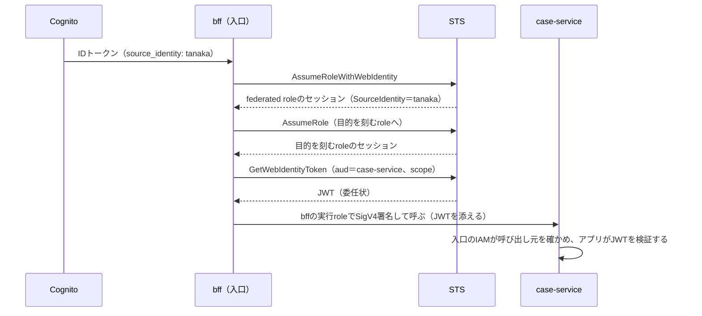

あるサービスに、次のJWTを付けた呼び出しが届きました（値の一部を伏せています）。

```json
{
  "iss": "https://<アカウント固有のID>.tokens.sts.global.api.aws",
  "aud": "Gekko08App:case-service",
  "sub": "arn:aws:iam::<アカウントID>:role/<目的を刻むrole>",
  "https://sts.amazonaws.com/": {
    "source_identity": "tanaka",
    "principal_tags": { "purpose": "case-summary", "requestId": "<リクエストID>" },
    "request_tags": { "scope": "case:summary" }
  }
}
```

署名したのはAWS STSです。受け取ったサービスは、このJWTから「tanakaの代理で」「自分（case-service）に宛てて」「案件の要約を読むこと（`case:summary`）を頼まれた」ことを確かめます。呼び出しにヘッダーで`x-user: yamada`のように別のユーザーを名乗らせても、判定に使うのはこのJWTの値だけなので、結果は変わりません。

「田中さんの代理で来ました」は、確かめようのない名乗りです。特殊詐欺が「息子さんの代理の者です」で始まるように、名乗りを信じる仕組みは名乗りで破られます。だから現実の窓口は、名乗りだけでは代理人を受け付けず、委任状や、委任者と代理人の本人確認書類を求めます。

本稿では、この窓口の委任の手続きを、AWSの中のサービス間の呼び出しで実現する方法を示します。使うのはCognito、STS、IAM、Lambdaだけで、認可サーバーは置きません。範囲は1つの呼び出しで、ログインしたユーザーの代理として最初のサービスを呼び、受け取ったサービスがそれを検証するところまでです。仕組みは参照実装[gekko_08](https://github.com/mahitotsu/gekko_08)として公開しています。

---

## 窓口は、名乗りではなく書類を見る

窓口で代理人が手続きをするときに求められるものは、機関や手続きによって違います。たとえば北國銀行は、代理人が窓口で振込をする場合について、振込依頼人と代理人の両方の本人確認書類が必要で、依頼人のための取引であることを電話か委任状などの書面で確かめる、と案内しています（[北國銀行のFAQ](https://support.hokkokubank.co.jp/faqs/f02603/)）。新宿区の戸籍の証明書の請求でも、代理人には委任状と、窓口に来た代理人の本人確認書類が求められます（[新宿区の案内](https://www.city.shinjuku.lg.jp/todokede/koseki02_001005.html)）。

細部は違っても、窓口が確かめていることは3つに整理できると私は考えています。

| 窓口で求められるもの | 確かめること |
|---|---|
| 委任者（田中さん）の本人確認書類 | 誰の代理か |
| 委任状 | 誰に宛てて、何を頼んだか |
| 代理人の本人確認書類 | 持ってきたのが代理人本人か |

そして窓口は、書類が揃っていても、田中さんがその口座を扱ってよいかまでは書類に頼りません。それは窓口の側が自分の記録で判断します。

サービス間の呼び出しでも、受け取った側が確かめたいことは同じです。誰の代理か、自分宛てか、何を頼まれたか、呼んできたのは誰か。**本稿の主題は、この3枚の書類を、STSが署名しIAMが強制するものに置き換えることです。**

## なぜ、ログインのときのトークンを渡さないのか

最初に浮かぶのは、ログインで得たトークン（OIDCのIDトークンやアクセストークン）をそのまま下流に渡す方法だと思います。手元にすでにあり、IdPの署名も付いているので、自然な発想です。

ただ、これは委任者の身分証明書のコピーだけを持ってきた人を、代理人として信じるのに近いと私は感じています。コピーは「誰の代理か」を示せても、「誰に宛てて何を頼まれたか」は示せません。ログインのトークンの`aud`はアプリのクライアントで、下流のサービスではないからです。受け取ったサービスは、自分宛てかを確かめられず、確かめることを諦めがちです。持ってきたのが誰かも示せません。トークンを手に入れた者は、誰でも同じように差し出せます。

この問題は、以前の記事「[奥までユーザーの権限を届けたい](https://zenn.dev/akring/articles/1a9f25fd6b04ab)」で「権限の丸ごと転送」として扱いました。そこでの解き方はOAuth Token Exchange（RFC 8693）で、認可サーバーがホップごとに、`sub`（誰の代理か）を保ったまま`aud`と`scope`を絞ったトークンに交換します。正攻法で、私は今もそう考えています。代わりに、認可サーバーを運用し続ける必要があります。

本稿では、その交換の役をSTSに担わせます。

## 全体像

対応を図にすると次のようになります。


*窓口で求められる書類と、gekko_08でそれを担う仕組み*

ログインからの流れは、次のとおりです。



入口のbff（Backend for Frontend）は、ユーザーのIDトークンをサーバー側に持ち、リクエストのたびにこの手順で最初のサービス宛てのJWTをSTSに発行させます。

この構成の要は、2種類の認証情報を分けることです。ホップ（Lambdaの関数）を呼ぶSigV4の署名は、常に呼び出し元の関数の実行roleで行います。ユーザーの代理のセッションは、JWTを作ることしかできず、ホップを呼ぶ権限を持ちません。**委任状を拾った人は、代理人の本人確認を通れないので、委任状だけではどのサービスも呼べません。**

## 委任者の身分証明書：IDトークンからSourceIdentityを刻む

STSのSourceIdentityは、roleを引き受けるときに設定する値で、一度設定すると変えられず、role chainingの先にも引き継がれます（[AssumeRoleWithWebIdentityのAPIリファレンス](https://docs.aws.amazon.com/STS/latest/APIReference/API_AssumeRoleWithWebIdentity.html)）。OIDCのIDトークンに`https://aws.amazon.com/source_identity`クレームがあれば、`AssumeRoleWithWebIdentity`がその値をSourceIdentityにします。

Cognito User Poolは既定ではこのクレームを入れないので、Pre Token Generation V2のトリガーで入れます。参照実装のトリガーは、これだけです。

```ts
export const handler = async (event: PreTokenGenerationV2TriggerEvent) => {
  event.response = {
    claimsAndScopeOverrideDetails: {
      idTokenGeneration: {
        claimsToAddOrOverride: { 'https://aws.amazon.com/source_identity': event.userName },
      },
    },
  };
  return event;
};
```

所属や役職などの業務属性は、トークンに入れません。入れると、異動が反映されるのはトークンを取り直したときになるからです。

IdPをIAMのOIDC providerとして登録し、federated roleの信頼ポリシーで、`aud`をアプリクライアントのIDに限ります（[コード](https://github.com/mahitotsu/gekko_08/blob/bfabebb9155f0fa5e6ea923a061042a889188dcf/infra/lib/constructs/auth-foundation.ts#L81-L99)）。

```json
{
  "Effect": "Allow",
  "Principal": { "Federated": "<User PoolのOIDC provider>" },
  "Action": "sts:AssumeRoleWithWebIdentity",
  "Condition": { "StringEquals": { "<発行者>:aud": "<アプリクライアントのID>" } }
}
```

`sts:SetSourceIdentity`は同じ相手にだけ許し、`sts:TagSession`は許しません。IDトークンにタグを入れないので、許す理由がないからです。この`aud`の条件がないと、同じUser Poolの別のアプリクライアントのトークンでも、同じユーザーとして引き受けられます（[脅威の総点検](https://github.com/mahitotsu/gekko_08/blob/main/docs/threats.md)のA-8）。

実際に委任状を発行するのは、federated roleのセッションではなく、そこから引き受けた「目的を刻むrole」のセッションです。ここでリクエストの目的とリクエストIDがタグとして付きます。その意味は次の記事で扱います。

### 身分証明書の発行元を、2か所で確かめる

委任者の身分証明書は、発行元が正しくなければ意味がありません。ところが、各ホップが受け取るJWTには、ユーザーを認証したIdPが残りませんでした。JWTはfederated roleから先のセッションが発行するもので、元のIdPを示す`federated_provider`クレームは、chainした先のセッションのJWTには入らなかったからです（[検証記録](https://github.com/mahitotsu/gekko_08/blob/main/experiments/federated-provider/RESULTS.md)）。

そこで、IdPを確かめる場所を入口の2か所にしました。federated roleの信頼ポリシーと、目的を刻むroleの信頼ポリシーです。後者では、条件キー`aws:FederatedProvider`で、このUser Poolで認証されたセッションだけを受け付けます（[コード](https://github.com/mahitotsu/gekko_08/blob/bfabebb9155f0fa5e6ea923a061042a889188dcf/infra/lib/constructs/bff.ts#L67-L89)）。片方の信頼ポリシーを誤っても、別のIdPのユーザーはリクエストを始められません。

ここで1つ、つまずきました。[条件キーの文書](https://docs.aws.amazon.com/IAM/latest/UserGuide/reference_policies_condition-keys.html#condition-keys-federatedprovider)では、AWSの組み込みでないIdPの値はOIDC providerのARNとされています。そのとおりARNで書いてデプロイすると、正規の呼び出しまですべて`AccessDenied`になりました。条件だけを変えた6つのroleで確かめたところ、2026-10-03（UTC）、ap-northeast-1のCognito User Poolでは、値は`https://`を除いた発行者（`cognito-idp.<region>.amazonaws.com/<User PoolのID>`）でした。文書ではARN、実機では発行者だった、という事実を並べておきます。

## 委任状：宛先とscopeを付けたJWTを発行する

委任状に当たるのは、`sts:GetWebIdentityToken`が発行するJWTです。IAMのアウトバウンドIDフェデレーションとして2025年11月に発表された機能で、AWSのワークロードの身元を、外部のサービスに証明するためのものです（[発表](https://aws.amazon.com/about-aws/whats-new/2025/11/aws-iam-identity-federation-external-services-jwts/)、[AWS News Blog](https://aws.amazon.com/blogs/aws/simplify-access-to-external-services-using-aws-iam-outbound-identity-federation)）。本稿では、これをAWSの内側の委任に使います。

呼び出し元は、宛先（`Audience`）と、scopeをタグ（`Tags`）として付けて発行させます。JWTには、SourceIdentityが`source_identity`として、セッションのタグが`principal_tags`として、発行時に付けたタグが`request_tags`として入ります。

大事なのは、委任状に何を書けるかをIAMが縛ることです。セッションに付ける権限は次のとおりです（[コード](https://github.com/mahitotsu/gekko_08/blob/bfabebb9155f0fa5e6ea923a061042a889188dcf/infra/lib/constructs/hop.ts#L171-L204)）。

```json
[
  {
    "Effect": "Allow", "Action": "sts:GetWebIdentityToken", "Resource": "*",
    "Condition": {
      "ForAllValues:StringEquals": { "sts:IdentityTokenAudience": ["Gekko08App:case-service"] },
      "Null": { "sts:IdentityTokenAudience": "false" },
      "StringEquals": { "sts:SigningAlgorithm": "ES384" },
      "NumericLessThanEquals": { "sts:DurationSeconds": 300 }
    }
  },
  {
    "Effect": "Allow", "Action": "sts:TagGetWebIdentityToken", "Resource": "*",
    "Condition": {
      "ForAllValues:StringEquals": {
        "sts:IdentityTokenAudience": ["Gekko08App:case-service"], "aws:TagKeys": ["scope"]
      },
      "Null": { "sts:IdentityTokenAudience": "false" },
      "StringEquals": { "aws:RequestTag/scope": ["case:summary"] }
    }
  }
]
```

1つ目の文は、宛先を内部のホップに限ります。宛先は複数を指定できる配列なので、書き方に注意が要ります。`ForAnyValue:StringEquals`で書くと「許した宛先を1つでも含めばよい」になり、許した宛先に外部の宛先を混ぜたJWTを発行できました（[検証記録](https://github.com/mahitotsu/gekko_08/blob/main/experiments/scope-tags/RESULTS.md)のE1-7）。`ForAllValues`は「すべてが許した宛先であること」ですが、宛先が空のときにも真になるので、`Null`で宛先があることも求めます。外部のサービスがこのJWTを単独で信じると、そこではユーザーになりすませるので、ここは委任状を外に持ち出させないための条件です（総点検のC-2）。

2つ目の文は、付けられるscopeを、呼び出し先が提供し、呼び出し元が使うと宣言したものに限ります。参照実装では、提供側と利用側がそれぞれ定義を書き、CDKが合成のときに突き合わせてこの文を生成します。宣言していないscopeでは、STSがJWTを発行しません（総点検のD-1）。宣言の仕組みの全体と、scopeをリクエストの目的で絞る方法は、次の記事で扱います。

JWTをそのまま受け取ればよく、IAMのセッションに戻す必要はないのか、と考えるかもしれません。それはできませんでした。自アカウントのSTSの発行者をOIDC providerとして登録しようとすると、IAMが`Creating an OIDC provider with an STS issuer URL from the same partition is not supported.`と拒否しました（[検証記録](https://github.com/mahitotsu/gekko_08/blob/main/experiments/multi-hop-propagation/RESULTS.md)の(c)）。そのため、JWTは受信側のアプリが検証します。

## 窓口での確認：受信側が確かめる3つと、書類に書かないもの

受け取ったサービスは、窓口と同じく3つを確かめます。

1つ目は、委任状が本物かです。署名をES384に固定し、`iss`を自アカウントのSTSの発行者に限り、その発行者が公開する鍵で検証します。アルゴリズムを固定しないと、署名を外したJWTや、公開鍵をHMACの鍵として使う取り違えを受け付けかねません（総点検のA-3〜A-6）。

2つ目は、自分宛てかです。`aud`が自分でなければ拒否します。別のサービス宛てのJWTを素通しで渡されても、ここで止まります（C-1）。

3つ目は、持ってきたのが代理人本人かです。ここは2段で確かめます。まず入口のIAMです。ホップはLambdaのFunction URLを`AWS_IAM`認証にしているので、SigV4の署名がなければ関数に届く前に403になります。そのうえで、resource policyで呼び出し元の実行roleだけを許し、それ以外を明示的にDenyします（[コード](https://github.com/mahitotsu/gekko_08/blob/bfabebb9155f0fa5e6ea923a061042a889188dcf/infra/lib/constructs/hop.ts#L110-L134)）。

```json
{
  "Sid": "DenyOtherPrincipals", "Effect": "Deny", "Principal": "*",
  "Action": ["lambda:InvokeFunctionUrl", "lambda:InvokeFunction"], "Resource": "<この関数>",
  "Condition": { "ArnNotEquals": { "aws:PrincipalArn": ["<呼び出し元の実行role>"] } }
}
```

このDenyは省けません。同じアカウントでは、resource policyが許していなくても、呼び出す側のidentity policyの広い許可だけで呼べてしまいます。Denyを入れる前の検証では、管理者の認証情報で署名した呼び出しが200で通りました（[検証記録](https://github.com/mahitotsu/gekko_08/blob/main/experiments/actor-subject-jwt/RESULTS.md)のx4）。

同じ実行roleを持つ別の関数からの呼び出しも区別します。条件キー`lambda:SourceFunctionArn`はresource-based policyでは使えないので（[Lambdaの文書](https://docs.aws.amazon.com/lambda/latest/dg/permissions-source-function-arn.html)）、呼び出し元の実行roleのidentity policyに、許した関数以外からの呼び出しをDenyする文を置きます（[コード](https://github.com/mahitotsu/gekko_08/blob/bfabebb9155f0fa5e6ea923a061042a889188dcf/infra/lib/constructs/hop.ts#L230-L252)）。この形でも、同じ実行roleの別の関数からの呼び出しは403になりました（[検証記録](https://github.com/mahitotsu/gekko_08/blob/main/experiments/source-function-arn/RESULTS.md)）。

入口を通ったら、アプリがJWTの`sub`を確かめます。`sub`はJWTを発行したroleのARNなので、それが入口を通った呼び出し元に対応するroleであることを求めます。代理人の本人確認書類と委任状の宛名が同じ人であることを確かめるのに当たります。別の経路で作られたJWTを持ち込まれても、ここで止まります（A-9）。最後に、scopeが提供側の定義にあるかを照合し、scopeのないJWTは何も許しません。受信側の実装は[共通部品](https://github.com/mahitotsu/gekko_08/blob/bfabebb9155f0fa5e6ea923a061042a889188dcf/packages/authz-context/src/inbound.ts#L80-L122)にあります。

ここまでで確かめたのは書類だけです。田中さんがその口座を扱ってよいかは、書類に書きません。受け取ったサービスは、検証したユーザーで属性サービスに問い合わせ、人事データと権限マスタから得た所属と権限で判断します。属性サービスは、照会する相手を引数に取らず、JWTのユーザー本人の分だけを返します。デモでは、osakaの担当者であるtanakaがtokyoの案件C-1001を開くと、case-serviceが業務上のアクセス権で403を返します。冒頭の場面に戻ると、ブラウザからのリクエストに`x-user`や`x-branch`、`x-purpose`のヘッダーを付けて別のユーザーや目的を名乗らせても、結果は403のまま変わらないことを、シナリオテストで確かめています（総点検のA-1）。

こうした条件は、1つ欠けると穴になります。参照実装では、ポリシーをCDKのコンストラクトで生成し、`ForAnyValue`に書き換える、Denyを消すといった壊し方をしたテンプレートを単体テストが見逃さないことを確かめています（[設計書§10](https://github.com/mahitotsu/gekko_08/blob/main/docs/design/architecture.md#10-テスト)）。委任状に書けることの縛りは、自分のIaCでもテストで守れます。

## たとえのずれと、代償

たとえは背骨として使ってきましたが、ずれるところが2つあります。

1つは、AWSでは身分証明書と委任状が1枚になることです。JWTには`source_identity`と`aud`、scopeが一緒に入り、まとめてSTSが署名します。窓口のように別々に偽造される心配がない一方で、委任者が自分で署名した書類ではありません。

もう1つは、委任状を書くのが田中さん本人ではないことです。ログインしたあと、田中さんに代わって入口のbffが委任状の中身（どのサービスに、何を頼むか）を決め、STSが署名します。bffが侵害されれば、ログイン中のユーザーとして、許された範囲のどの委任状でも書けます。bffは信頼の起点で、この構成はそれを守りません（総点検のA-11）。

代償もあります。

- **レイテンシ**：呼び出し先を持つホップごとに、chainとJWTの発行がSTSへの往復として加わり、ウォームでおよそ150ms（トレースの送信を含む）かかりました（2026-10-01、ap-northeast-1で測定。[設計ガイド§6](https://github.com/mahitotsu/gekko_08/blob/main/docs/guide.md#レイテンシの実測)）。認可サーバーへの往復がSTSへの往復に置き換わるだけで、回数は減りません。
- **上限が文書にない**：`GetWebIdentityToken`の呼び出し回数の上限は、文書にもService Quotasにも見つかりませんでした（2026-10-01に確認）。
- **取り消せない**：発行した委任状（JWT、有効期間5分）は、途中で取り消せません。

1つの呼び出しの範囲で、総点検が「防がない」としたものには、次があります。

- **A-12**：Pre Token Generationの関数やUser Poolの設定を改ざんされると、任意のSourceIdentityを入れられます。AWSは値の正しさを検証しないので、ここは信頼の起点です。
- **A-13**：IAMを書き換えられるアカウントの管理者は、信頼ポリシーを書き換えられます。単一のアカウントの中でIAMに強制させる構成なので、管理者に対する境界はアカウントの分離やSCPで作ります。
- **B-6**：実行環境から実行roleの認証情報と受け渡したセッションの両方を持ち出されると、有効期限内はその関数として呼べます。`lambda:SourceFunctionArn`は認証情報に刻まれた関数で判定するので、持ち出した認証情報でも同じ関数として扱われました。

総点検は、RFCやOWASP、MCPのベストプラクティスから既知の攻撃を拾って網羅を試みた一覧で、2026-10-03（UTC）時点で61件あります。止める層と証拠、止めない理由は[docs/threats.md](https://github.com/mahitotsu/gekko_08/blob/main/docs/threats.md)にあります。

---

## おわりに

「田中さんの代理で来ました」は、名乗りのままでは確かめようがありません。本稿では、それをSTSが署名する書類に置き換えました。誰の代理かはSourceIdentityが、誰に何を頼んだかはJWTの`aud`とscopeが表し、何を書けるかはIAMが縛ります。持ってきたのが代理人本人かは、入口のIAMが実行roleで確かめます。認可サーバーを置かずに、窓口と同じ確認ができる、というのが私の得た手応えです。

余談ですが、`GetWebIdentityToken`は、AWSのワークロードが外部のサービスに自分の身元を証明するための機能として発表されました。外に向けた身分証明の部品が、内側の委任状にもそのまま使えたことになります。外部との連携と内部の認可は、別々の仕組みで考えがちですが、「誰が、誰に宛てて、何のために」を署名付きで示すという点では、同じ問題の両面なのかもしれません。

次の記事では、この仕組みで実際の業務プロセス（凍結された口座の見直し）を組みます。手続きごとに委任状の中身を変え、代理人がさらに別の代理人に頼む（復代理）多段の呼び出しと、そこに加わるAIエージェントを扱います。

本稿が、サービス間で「誰の代理か」をどう確かめるかを考えるきっかけになれば幸いです。
