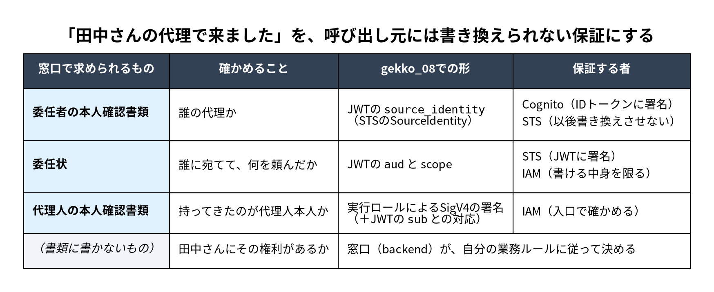
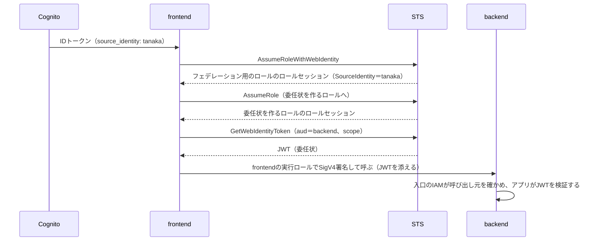

Webやモバイルのアプリで、画面の裏で動くサーバー（frontend）がbackendのAPIを呼ぶ構成は、ごく身近だと思います。たとえば、次のような呼び出しです。

```http:frontendからbackendへの呼び出し（よくある形）
GET /cases/C-2001/summary HTTP/1.1
x-api-key: <frontendに発行したAPIキー>
x-user-id: tanaka
```

frontendは、ログインした田中さんに頼まれて、田中さんの代理でbackendに処理を頼んでいます。ところが、backendが確かめられるのはAPIキー、つまり「frontendはbackendを呼んでよい」ことだけです。田中さんの代理であることは、`x-user-id`という名乗りでしか示されていません。

銀行や役所の窓口に置き換えると、「田中さんの代理で来ました」と言う人に、窓口の係員が「あなたが窓口で手続きを頼める方なのはわかりました。でも、田中さんの代理だという証明はありませんね」と返す状態です。現実の窓口なら、ここで委任状や、委任者と代理人の本人確認書類を求めます。ところがシステムでは、この名乗りをそのまま受け付けていることが多いのではないでしょうか。frontendが乗っ取られたり、途中のサービスが書き換えたりすれば、`x-user-id`は誰の名前にでもなります。特殊詐欺が「息子さんの代理の者です」で始まるように、確かめようのない名乗りをそのまま信じる仕組みは、偽りの名乗りで破られます。名乗りそのものはなくせないので、名乗りを確かめられる形にする必要があります。

この記事では、窓口での委任の手続きを、AWSの中のサービス間の呼び出しで実現する方法を示します。使うのはCognito、STS、IAM、Lambdaだけで、認可サーバーは置きません。範囲は1つの呼び出しで、frontendがログインしたユーザーの代理としてbackendを呼び、backendがそれを検証するところまでです。呼び出しが多段になる場合（代理人がさらに別の代理人に頼む場合）、リクエストの目的とリクエストIDの扱い、scopeや呼び出し元の一覧をCDKで生成する仕組みは、別の記事で扱います。仕組みは参照実装[gekko_08](https://github.com/mahitotsu/gekko_08)として公開しています。

---

## 窓口は、名乗りではなく書類を見る

では、現実の窓口は、代理人の名乗りをどう確かめているのでしょうか。たとえば三菱UFJ信託銀行は、家族が代理で取引する場合について、委任状を出すときは、名義人本人と来店する人の両方の確認書類を提示するよう案内しています（[「ご本人さまのご確認」について](https://www.tr.mufg.jp/ippan/tetsuzuki/kakunin.html)）。ゆうちょ銀行も、委任状をもとに代理人が払い戻しなどの手続きをするときは、代理人の本人確認書類と印章が要るとしています（[委任状について](https://www.jp-bank.japanpost.jp/tetuzuki/ininjo/tzk_inj_index.html)）。

求められる書類は機関や手続きによって少しずつ違いますが、私は、どの窓口も同じ3つを確かめていると考えています。そして、その書類には共通点があります。どれも、持ってきた代理人とは別の誰かが中身を保証していることです。

| 窓口で求められるもの | 確かめること | 誰が保証しているか |
|---|---|---|
| 委任者（田中さん）の本人確認書類 | 誰の代理か | 発行した公的な機関（運転免許証など） |
| 委任状 | 誰に宛てて、何を頼んだか | 委任者本人（自筆と押印） |
| 代理人の本人確認書類 | 持ってきたのが代理人本人か | 発行した公的な機関 |

本人確認書類は公的な機関が発行し、委任状は委任者本人が書きます。先のゆうちょ銀行の案内は、委任状のすべての欄を、委任する本人が自筆で書き、押印するよう求めています。名乗りは名乗る本人しか保証しませんが、書類は代理人には書き換えられない誰かが保証します。**窓口が名乗りではなく書類を見るのは、代理人の言い分ではなく、代理人以外の保証を確かめるためだと私は考えています。**

一方で、書類が保証するのは、頼まれたことまでです。「田中さんの代理で来ました。渡辺さんの口座の残高を見せてください」は、委任状と本人確認書類が揃っていても通りません。先の三菱UFJ信託銀行の案内でも、代理で取引できるのは、口座の名義人本人が委任した場合です。委任状は「田中さんに頼まれたこと」を示しても、「田中さんにその権利があること」までは示しません。

ここで冒頭の呼び出しに戻ります。`x-user-id: tanaka`は、frontendが自分で書いた値で、ほかに保証している者がいません。窓口で言えば、書類のない名乗りです。この記事では、窓口の3枚の書類を、呼び出し元には書き換えられないAWSの保証に置き換えます。田中さんを認証したことはIdP（Cognito）が署名し、委任状はSTSが署名して、書ける中身をIAMが限定します。呼び出し元が誰かは、AWSが関数に渡した認証情報による署名を、IAMが確かめます。田中さんにその権利があるかは、窓口と同じく書類には書かず、受け取った側が確かめます。

窓口と違うのは、委任状を作るのが田中さん本人ではなく、frontendだという点です。そのため、この委任状は、田中さんがその操作を承認したことまでは示しません。示せるのは、田中さんとして認証されたセッションがなければ、この委任状は作れないという事実です。その代わり、委任状は欄ごとに書き手が違います。「誰の代理か」の欄はfrontendには書けず、Cognitoが署名した田中さんのIDトークンから設定したセッションの値をSTSが写し、以後は書き換えさせません。「誰に宛てて、何を頼むか」の欄はfrontendが書きますが、書ける値をIAMが限定します。署名はSTSがします。何を頼むかをfrontendが決める以上、frontendは信頼の起点として残ります。これは最後に扱います。

## なぜ、ログインのときのトークンを渡さないのか

最初に浮かぶのは、ログインで得たトークン（OIDCのIDトークンやアクセストークン）をそのまま下流に渡す方法だと思います。手元にすでにあり、IdPの署名も付いているので、自然な発想です。

ただ、これは委任者の本人確認書類のコピーだけを持ってきた人を、代理人として信じるのに近いと私は感じています。コピーは「誰の代理か」を示せても、「誰に宛てて何を頼まれたか」は示せません。たとえばIDトークンの`aud`はアプリのクライアントで、下流のサービスではないからです。受け取ったサービスは、自分宛てかを確かめられず、確かめることを諦めがちです。持ってきたのが誰かも示せません。トークンを手に入れた者は、誰でも同じように差し出せます。

この問題は、以前の記事「[奥までユーザーの権限を届けたい](https://zenn.dev/akring/articles/1a9f25fd6b04ab)」で「権限の丸ごと転送」として扱いました。そこでは、OAuth Token Exchange（RFC 8693）で解きました。ログインのトークンをそのまま渡すのではなく、呼び出すたびに認可サーバーに交換してもらい、`sub`（誰の代理か）は保ったまま、`aud`（宛先）を呼び出し先に、`scope`（頼む操作）をその呼び出しに必要なものだけに絞った新しいトークンを使います。窓口で言えば、宛先と委任事項を書いた委任状を、信頼できる発行者に毎回作ってもらう形です。標準に沿った正攻法だと、私は今も考えています。

ただし、その発行者である認可サーバー（以前の記事ではKeycloak）は、自分たちで動かし続ける必要があります。この記事では、委任状の発行者を、AWSが運用するSTSに替えます。替わるのは署名だけではありません。委任状を発行してよいか、何を書いてよいかの判定も、認可サーバーの設定ではなく、IAMのポリシーの評価が担います。

## 全体像

前の節の3枚の書類と、それを保証する者を、gekko_08の仕組みに対応させると次のようになります。


*窓口で求められる書類と、gekko_08での形、それを保証する者*

ログインからbackendを呼ぶまでの流れは、次のとおりです。

1. 田中さんがログインすると、CognitoがIDトークンを発行します。委任者の本人確認書類に当たるもので、frontendはこれをサーバー側に保管します。
2. リクエストのたびに、frontendはIDトークンをSTSに渡し（`AssumeRoleWithWebIdentity`）、フェデレーション用のロール（federated role）のロールセッションを受け取ります。ロールセッションは、STSが発行する有効期限の短い認証情報（一時的セキュリティ認証情報。[IAMの文書](https://docs.aws.amazon.com/ja_jp/IAM/latest/UserGuide/id_credentials_temp.html)）で、このときSourceIdentityとして`tanaka`が刻まれます。
3. frontendは、そのロールセッションで、委任状を作るロール（参照実装では「目的を刻むrole」と呼んでいます）を引き受け、2つ目のロールセッションを得ます。ロールのセッションで次のロールを引き受けることを、ロールの連鎖（role chaining）と呼びます。IDトークンから付けられるタグはログインのときに決まるので、リクエストごとの目的をセッションに刻むために、ロールをもう1つ挟んでいます。このセッションにできるのはSTSへの依頼だけで、backendを呼ぶ権限はありません。
4. frontendは、このセッションでSTSに委任状の発行を頼み（`GetWebIdentityToken`）、JWTを受け取ります。誰の代理かはセッションから引き継がれ、frontendは変えられません。宛先と頼む操作はfrontendが指定し、IAMが許した範囲だけを書けます。
5. frontendは、自分の実行ロールでSigV4の署名をして、JWTを添えてbackendを呼びます。

図にすると次のようになります。



参照実装では、frontendをBFF（Backend for Frontend）の`bff`として、backendを案件を扱う`case-service`として作っています。

この構成の要は、委任状を作る権限と、backendを呼ぶ権限を、別々の認証情報に分けることです。backendを呼ぶSigV4の署名は、常にfrontendの関数の実行ロールで行います。委任状を作るロールセッションは、STSに委任状を頼むことしかできず、backendを呼ぶ権限を持ちません。

こうしておくと、片方が漏れても、それだけではbackendに届きません。委任状を作るロールセッションだけが漏れた場合、作れるのは田中さんの代理の委任状だけで（誰の代理かはセッションに刻まれています）、それを添えてbackendを呼ぶ署名ができません。frontendの実行ロールだけが漏れた場合、backendは呼べても、有効な委任状がないので、受信側の共通部品が401を返します。委任状（JWT）だけを拾った人も、代理人の本人確認書類（実行ロールの署名）を持っていないので、入口で止まります。**権限を2つに分けることで、どちらか一方が漏れただけでは、田中さんの代理としてbackendの処理を実行できないようにしています。** 両方を持ち出された場合は別で、最後に扱います。

## 委任者の本人確認書類：IDトークンからSourceIdentityを刻む

STSのSourceIdentityは、ロールを引き受けるときに設定する値で、一度設定すると変えられず、ロールの連鎖の先にも引き継がれます（[AssumeRoleWithWebIdentityのAPIリファレンス](https://docs.aws.amazon.com/STS/latest/APIReference/API_AssumeRoleWithWebIdentity.html)）。OIDCのIDトークンに`https://aws.amazon.com/source_identity`クレームがあれば、`AssumeRoleWithWebIdentity`がその値をSourceIdentityにします。

Cognito User Poolは既定ではこのクレームを入れないので、Pre Token Generation V2のトリガーで入れます。V2のトリガーには、User PoolのEssentials以上の機能プランが要ります。参照実装のトリガーは、これだけです。

```ts:services/pretoken/src/index.ts（抜粋）
export const handler = async (event: PreTokenGenerationV2TriggerEvent) => {
  event.response = {
    claimsAndScopeOverrideDetails: {
      idTokenGeneration: {
        claimsToAddOrOverride: { 'https://aws.amazon.com/source_identity': event.userName },
      },
    },
  };
  return event;
};
```

STSにCognitoのIDトークンを受け付けさせるには、設定が2つ要ります。1つは、User PoolをIAMのOIDC providerとして登録することです。これで、STSはこのUser Poolが署名したIDトークンを検証できるようになります。もう1つは、フェデレーション用のロールの信頼ポリシーで、どのIDトークンならこのロールのロールセッションを始めてよいかを書くことです（[コード](https://github.com/mahitotsu/gekko_08/blob/bfabebb9155f0fa5e6ea923a061042a889188dcf/infra/lib/constructs/auth-foundation.ts#L81-L99)）。

```json:フェデレーション用のロールの信頼ポリシー（抜粋）
{
  "Effect": "Allow",
  "Principal": { "Federated": "<User PoolのOIDC provider>" },
  "Action": ["sts:AssumeRoleWithWebIdentity", "sts:SetSourceIdentity"],
  "Condition": { "StringEquals": { "<発行者>:aud": "<アプリクライアントのID>" } }
}
```

IDトークンからSourceIdentityを設定するので、`sts:AssumeRoleWithWebIdentity`だけでなく`sts:SetSourceIdentity`も許します。意図したIdP（このUser Pool）が、frontendに宛てて発行したIDトークン（`aud`がfrontendのアプリクライアントのID）を持っているときだけ、フェデレーション用のロールのロールセッションを始められる、という条件です。`aud`の条件がないと、同じUser Poolがfrontend以外のアプリクライアントに宛てて発行したIDトークンでも、同じユーザーとして引き受けられてしまいます。

### 本人確認書類は、委任状を作る段階で確かめる

backendに届くのは委任状だけで、田中さんの本人確認書類（IDトークン）そのものは届きません。委任状には「tanakaの代理」と書かれていても、その本人確認書類をどのIdPが発行したかは書かれていません（[検証記録](https://github.com/mahitotsu/gekko_08/blob/main/experiments/federated-provider/RESULTS.md)）。backendは、委任状を作る段階で本人確認書類が確かめられたことを信頼します。その信頼を置けるのは、委任状の作り方を知っているからです。委任状の作成をSTSに頼めるのは、委任状を作るロールのロールセッションだけで、そのロールのセッションは、下に書く本人確認書類の確認を通らないと得られません。委任状の`sub`には作成を頼んだロールが入るので、backendはそれが委任状を作るロールであることを確かめられます（詳しくは後述）。

backendがこの信頼を十分に置けるように、本人確認書類は、委任状を作る段階で2回確かめます。1回目は、frontendがIDトークンでロールセッションを始めるとき（先のフェデレーション用のロールの信頼ポリシー）です。2回目は、委任状を作るロールのロールセッションを得るとき（委任状を作るロールの信頼ポリシー）で、条件キー`aws:FederatedProvider`で、このUser Poolで認証されたことを確かめます（[コード](https://github.com/mahitotsu/gekko_08/blob/bfabebb9155f0fa5e6ea923a061042a889188dcf/infra/lib/constructs/bff.ts#L67-L89)）。片方の設定を誤っても、別のIdPの本人確認書類では委任状を作れません。

```json:委任状を作るロールの信頼ポリシー（抜粋）
[
  {
    "Effect": "Allow",
    "Principal": { "AWS": "<フェデレーション用のロール>" },
    "Action": "sts:AssumeRole",
    "Condition": { "StringEquals": { "aws:FederatedProvider": "cognito-idp.<region>.amazonaws.com/<User PoolのID>" } }
  },
  { "Effect": "Allow", "Principal": { "AWS": "<フェデレーション用のロール>" }, "Action": "sts:SetSourceIdentity" }
]
```

SourceIdentityを引き継ぐロールの連鎖でも、`sts:SetSourceIdentity`を許す必要があります。この文は`sts:AssumeRole`が許されたときにだけ効くので、条件は`sts:AssumeRole`の文に置いています。目的のタグを付けるための`sts:TagSession`とセッション名の条件は、抜粋から省いています。

:::message
`aws:FederatedProvider`の値には、OIDC providerのARNではなく、`https://`を除いた発行者を書きます。[条件キーの文書](https://docs.aws.amazon.com/IAM/latest/UserGuide/reference_policies_condition-keys.html#condition-keys-federatedprovider)ではARNとされていますが、Cognito User Poolでは発行者の形でした。ARNで書くと、正規の手順の呼び出しまで`AccessDenied`になりました（2026-10-03（UTC）、ap-northeast-1で確認。[検証記録](https://github.com/mahitotsu/gekko_08/blob/main/experiments/federated-provider/RESULTS.md)）。
:::

## 委任状：宛先とscopeを付けたJWTを発行する

委任状に当たるのは、`sts:GetWebIdentityToken`が発行するJWTです。IAMのアウトバウンドIDフェデレーションとして2025年11月に発表された機能で、AWSのワークロードの身元を、外部のサービスに証明するためのものです（[発表](https://aws.amazon.com/about-aws/whats-new/2025/11/aws-iam-identity-federation-external-services-jwts/)、[AWS News Blog](https://aws.amazon.com/blogs/aws/simplify-access-to-external-services-using-aws-iam-outbound-identity-federation)）。この記事では、これをAWSの内側の委任に使います。AWSが内側のサービス間の委任の方法として示しているものではなく、参照実装で成り立つことを確かめた使い方です。使うには、IAMのアウトバウンドIDフェデレーションを、アカウント単位で有効にしておく必要があります。アカウント全体の設定なので、参照実装は自動では有効にせず、無効ならデプロイを止めて有効にする手順を示します（[README](https://github.com/mahitotsu/gekko_08/blob/main/README.md#前提条件)）。また、`GetWebIdentityToken`はSTSのグローバルエンドポイントでは使えず、リージョンのエンドポイントで呼びます（[APIリファレンス](https://docs.aws.amazon.com/STS/latest/APIReference/API_GetWebIdentityToken.html)）。

呼び出し元は、宛先（`Audience`）と、scopeをタグ（`Tags`）として付けて発行させます。JWTには、SourceIdentityが`source_identity`として、セッションのタグが`principal_tags`として、発行時に付けたタグが`request_tags`として入ります。発行された委任状は、次のような形です（値の一部を伏せています）。

```json:backendが受け取るJWTのペイロード（抜粋）
{
  "iss": "https://<アカウント固有のID>.tokens.sts.global.api.aws",
  "aud": "<backendのaud>",
  "sub": "arn:aws:iam::<アカウントID>:role/<委任状を作るロール>",
  "https://sts.amazonaws.com/": {
    "source_identity": "tanaka",
    "principal_tags": { "purpose": "case-summary", "requestId": "<リクエストID>" },
    "request_tags": { "scope": "case:summary" }
  }
}
```

「tanakaの代理で」「backendに宛てて」「案件の要約を読むこと（`case:summary`）を頼む」と書かれ、STSが署名しています。`principal_tags`のリクエストの目的とリクエストIDは、冒頭で触れたとおり別の記事で扱います。

大事なのは、委任状を発行してよいか、何を書いてよいかを、IAMのポリシーの評価が判定することです。委任状の発行について、認可サーバーが実行時に担っていた判定が、IAMに移ります。セッションに付ける権限は次のとおりです（[コード](https://github.com/mahitotsu/gekko_08/blob/bfabebb9155f0fa5e6ea923a061042a889188dcf/infra/lib/constructs/hop.ts#L171-L204)）。

```json:委任状を作るロールセッションの権限（抜粋）
[
  {
    "Effect": "Allow", "Action": "sts:GetWebIdentityToken", "Resource": "*",
    "Condition": {
      "ForAllValues:StringEquals": { "sts:IdentityTokenAudience": ["<backendのaud>"] },
      "Null": { "sts:IdentityTokenAudience": "false" },
      "StringEquals": { "sts:SigningAlgorithm": "ES384" },
      "NumericLessThanEquals": { "sts:DurationSeconds": 300 }
    }
  },
  {
    "Effect": "Allow", "Action": "sts:TagGetWebIdentityToken", "Resource": "*",
    "Condition": {
      "ForAllValues:StringEquals": {
        "sts:IdentityTokenAudience": ["<backendのaud>"], "aws:TagKeys": ["scope"]
      },
      "Null": { "sts:IdentityTokenAudience": "false" },
      "StringEquals": { "aws:RequestTag/scope": ["case:summary"] }
    }
  }
]
```

1つ目の文は、指定できる宛先（`aud`）を、意図した宛先（backend）に限定します。宛先は複数を指定できる配列なので、書き方に注意が要ります。`ForAnyValue:StringEquals`で書くと「許した宛先を1つでも含めばよい」になり、許した宛先に外部の宛先を混ぜたJWTを発行できました（[検証記録](https://github.com/mahitotsu/gekko_08/blob/main/experiments/scope-tags/RESULTS.md)のE1-7）。`ForAllValues`は「すべてが許した宛先であること」ですが、宛先が空のときにも真になるので、`Null`で宛先があることも求めます。

2つ目の文は、付けられるscopeを、呼び出し先が提供し、呼び出し元が使うと宣言したものに限定します。宣言していないscopeでは、STSがJWTを発行しません。呼び出し元と呼び出し先の組が増えると、この文を手で正しく保つのは難しくなります。そこで参照実装では、呼び出し先は提供するscopeの一覧を、呼び出し元は使うscopeを、それぞれ定義として書き、CDKがIAMのポリシーを合成するときに両者の整合を確かめてから、この文を生成しています。

## 窓口での確認：backendが確かめる3つ

委任状を受け取ったbackendは、窓口の係員と同じく、3つのことを確かめます。書類が本物か、書かれた中身が自分への依頼として揃っているか、持ってきたのが代理人本人かです。

1つ目は、委任状が本物で、改ざんされていないことです。委任状にはSTSが秘密鍵で署名しているので、backendはSTSが公開している公開鍵で署名を検証します。検証できれば、STSが作り、その後に書き換えられていない委任状だとわかります。使う公開鍵は自アカウントのSTSが公開するものだけです。発行者のURLはアカウントごとに違うので、別のAWSアカウントのSTSが発行した委任状は、ここで通りません。署名の方式は、発行側のIAM（前の節の`sts:SigningAlgorithm`）と検証側の両方でES384に固定し、想定外の方式を受け入れる余地をなくします。

2つ目は、委任状の中身です。誰が作ったか（`iss`が自アカウントのSTSで、`sub`が作成を頼んだロール）、誰に宛てたか（`aud`がbackend自身）、誰の代理か（`source_identity`）、何を頼んだか（scope）を確かめます。`sub`は、入口を通った呼び出し元に対応づけたロールと照合します。frontendからの呼び出しなら、委任状を作るロールです。別の手順で作られた委任状は、ここで止まります。宛先が違う委任状も、別のサービス宛てのものを素通しで渡されたとみなして拒否します。`source_identity`やscopeのない委任状は何も許さず、scopeは、backendが提供すると定義したscopeに含まれるかを照合します。受信側の実装は[共通部品](https://github.com/mahitotsu/gekko_08/blob/bfabebb9155f0fa5e6ea923a061042a889188dcf/packages/authz-context/src/inbound.ts#L80-L122)にあります。

3つ目は、持ってきたのが代理人本人かです。SigV4で署名された呼び出しからは、署名したIAMのロールがわかります。これが代理人の本人確認書類に当たります。注意したいのは、ここで署名するロールが、委任状を作るロールではなく、代理人であるfrontend自身の実行ロールだということです。

**3つ目の確認は、backendのアプリではなく、IAMのresource policyに任せます。** どの代理人がbackendを呼べるかをresource policyの条件で制限し、それ以外の呼び出しは関数に届く前に止めます。そのために、backendのFunction URLを`AWS_IAM`認証にして署名のない呼び出しを止め、resource policyでfrontendの実行ロール以外の署名をDenyします（[コード](https://github.com/mahitotsu/gekko_08/blob/bfabebb9155f0fa5e6ea923a061042a889188dcf/infra/lib/constructs/hop.ts#L110-L134)）。

```json:backendの入口のresource policy（抜粋）
{
  "Sid": "DenyOtherPrincipals", "Effect": "Deny", "Principal": "*",
  "Action": ["lambda:InvokeFunctionUrl", "lambda:InvokeFunction"], "Resource": "<この関数>",
  "Condition": { "ArnNotEquals": { "aws:PrincipalArn": ["<呼び出し元の実行ロール>"] } }
}
```

Allowではなく明示的なDenyにしているのは、同じアカウントでは、resource policyが許していなくても、呼び出す側のidentity policyの広い許可だけで呼べてしまうからです（[検証記録](https://github.com/mahitotsu/gekko_08/blob/main/experiments/actor-subject-jwt/RESULTS.md)）。呼び出し元の一覧は、backendの作り手が手で書くのではありません。各呼び出し元が「このbackendを呼ぶ」と自分の側で宣言し、CDKがそれを集めて一覧を作り、呼び出し先であるbackendのresource policyに書き込みます。同じ実行ロールを別の関数が使う場合の区別など、ポリシーの細部は[設計書§5](https://github.com/mahitotsu/gekko_08/blob/main/docs/design/architecture.md#5-iamの設計)にあります。

ここまでで確かめたのは書類だけです。田中さんが渡辺さんの口座を見てよいかどうかは、受け取った書類ではなく、窓口で業務を行う側が、自分の業務ルールに従って決めることです。

## 代償と、防がないもの

この構成には代償があります。

- **レイテンシ**：この参照実装では、frontendがbackendを呼ぶリクエストごとに、STSへの往復が3回加わり、中央値の合計で約110msでした。内訳は、`AssumeRoleWithWebIdentity`が15ms、委任状を作るロールへの`AssumeRole`が55ms、`GetWebIdentityToken`が42msです（2026-10-01、ap-northeast-1、ウォームで測定。[設計ガイド§6](https://github.com/mahitotsu/gekko_08/blob/main/docs/guide.md#レイテンシの実測)）。認可サーバーでトークンを交換する構成なら、呼び出し1回につき往復は1回なので、往復の回数はむしろ増えます。その代わり、認可サーバーとその署名鍵の保管、ローテーション、可用性の確保は、自分たちの運用から外れ、AWSの責任になります。その分、STSが止まれば、backendを呼ぶ経路も止まります。
- **上限の一部が文書にない**：文書にある上限は、`AssumeRole`などが共有するSTSの呼び出しの毎秒600件（アカウント・リージョンごと）で、この構成ではリクエストごとに1回使います。一方、`GetWebIdentityToken`と`AssumeRoleWithWebIdentity`の上限は、文書にもService Quotasにも見つかりませんでした（2026-10-01に確認。[設計書§11](https://github.com/mahitotsu/gekko_08/blob/main/docs/design/architecture.md#11-前提条件と制約)）。
- **取り消せない**：発行した委任状（JWT、有効期間5分）は、途中で取り消せません。
- **1つのCDKアプリに収まる範囲が前提**：呼び出し元の宣言を集めてbackendのresource policyに書き込むのは、CDKの合成の中で行っています。参照実装はすべてのサービスを1つのCDKアプリ（1つのスタック）に置いているので、これが成り立ちます。サービスごとにリポジトリやチームが分かれる構成では、宣言を共有する場所と、宣言をレビューする手順が別に要り、参照実装はまだそれを持っていません（[設計ガイド§7](https://github.com/mahitotsu/gekko_08/blob/main/docs/guide.md#7-将来の拡張の方向)）。

防がないものもあります。参照実装では、RFCやOWASP、MCPのベストプラクティスから既知の攻撃を拾い、どこで止めるか、止めないならなぜかを一覧にしています（[脅威の総点検](https://github.com/mahitotsu/gekko_08/blob/main/docs/threats.md)。網羅を試みた一覧で、2026-10-03（UTC）時点で61件）。そのうち、1つの呼び出しの範囲で防がないと決めたものは、次のとおりです。

- **frontendの侵害**：frontendはログイン中のすべてのユーザーのIDトークンを持っているので、侵害されれば、ログイン中の誰の代理としても、許された範囲の委任状を作れます。frontendは信頼の起点です。それでも、誰の代理かはIDトークンからしか設定できないので、ログインしていないユーザーの代理にはなれません。frontendが自分の鍵（KMSなど）で委任状に署名する構成なら、侵害されたときには誰の代理の委任状でも作れます。
- **IdPの設定の改ざん**：Pre Token Generationの関数やUser Poolの設定を改ざんされると、任意のSourceIdentityを入れられます。AWSは値の正しさを検証しないので、ここは信頼の起点です。
- **アカウントの管理者**：IAMを書き換えられる管理者は、信頼ポリシーを書き換えられます。単一のアカウントの中でIAMに強制させる構成なので、管理者に対する境界はアカウントの分離やSCPで作ります。
- **両方の認証情報の持ち出し**：実行環境から、実行ロールの認証情報と委任状を作るロールセッションの両方を持ち出されると、有効期限内（ロールセッションは15分、委任状は5分）に限り、そのロールセッションのユーザーの代理として、そのロールで書ける範囲の委任状を添えて、frontendとしてbackendを呼べます。持ち出した認証情報で呼んでも、IAMにはfrontendからの呼び出しと区別できませんでした。

---

## おわりに

frontendがAPIキーでbackendを呼ぶ構成では、確かめられるのは「frontendが呼んでよいこと」だけで、「誰の代理か」はfrontendの名乗りに任されます。この記事で伝えたかったのは、この2つを分けて考え、「誰の代理か」も、名乗った本人以外が保証するものにしておくことです。AWSでは、そのための部品がCognito、STS、IAMにすでに揃っていて、認可サーバーを置かずに組み立てられました。

一方で、すべてをAWSのサービスに任せたわけではありません。frontendは信頼の起点のままで、田中さんにその権利があるかは、これまでどおりbackendが自分の業務ルールで決めます。

この仕組みを説明するために窓口の委任の手続きを調べてみると、AWSで組んだ形とほぼそのまま対応していました。委任状は委任者本人が書き、本人確認書類は公的な機関が発行し、代理人は自分の書類を別に見せます。代理人が自分だけで完成させられる書類は、1枚もありません。AWSで組んだ形でも、委任状を書くのはfrontendですが、誰の代理かの欄と署名はSTSが担います。この分け方をAWSの部品に当てはめたのが、全体像で示した次の対応です。


*窓口で求められる書類と、gekko_08での形、それを保証する者（再掲）*

正直に書くと、私はこれまで、認証と認可の概念はややこしく、難しいものだと感じていました。トークンの種類やクレームの名前を追っても、全体の筋がなかなかつかめなかったからです。それが、現実の窓口で代理を頼む手続きに置き換え、誰が何を保証しているかで整理してみると、かなり理解が進みました。手がかりになったのは、次の原則です。

:::message
**名乗りは、受け取った側が確かめられる形で受け取る。確かめられない名乗りが残るなら、その場所を明示する。**
:::

窓口の手続きは、この原則をそのまま形にしています。代理人がいくら「田中さんの代理です」と言っても、窓口はそれだけでは受け付けず、委任状と本人確認書類を求めます。どちらも代理人ではない誰か（委任者本人や公的な機関）が保証したもので、窓口はそれを自分で確かめられます。この記事でAWSに置き換えたのも、同じことです。frontendが`x-user-id`で名乗る代わりに、Cognitoが認証してSTSが署名したJWTを渡し、backendはその署名を自分で検証します。呼んできたのがfrontendであることも、frontendの名乗りではなく、IAMが署名から確かめます。

とはいえ、この構成にも、確かめられない名乗りは残っています。何を頼むかはfrontendが決め、その中身が田中さんの意思どおりかは確かめられません。この名乗りは、frontendを信頼の起点として明示し、書ける範囲をIAMで限定しています。

自分のシステムでも、どこかで確かめられない名乗りをそのまま信じていないか、信じているなら、それを誰に保証させれば受け取った側が確かめられるかを、一度見直してみてはどうでしょうか。この記事が、その見直しのきっかけになれば幸いです。
