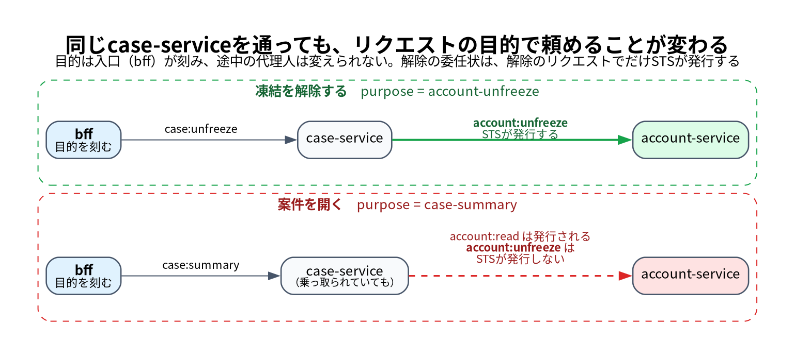

[前回の記事](<1本目のURL>)では、frontendがログインした田中さんの代理としてbackendを呼ぶときの「田中さんの代理です」という名乗りを、backendが確かめられる形に置き換えました。誰の代理かはCognitoが署名したIDトークンからSTSが写し、誰に宛てて何を頼むかはfrontendが書ける範囲をIAMが限ってSTSが署名し、誰が呼んできたかは入口のIAMが確かめます。

実際のシステムでは、呼ばれたbackendが、さらに別のサービスに処理を頼みます。参照実装[gekko_08](https://github.com/mahitotsu/gekko_08)で田中さんが大阪の案件C-2001を開くと、呼び出しは次のように続きます。前回のfrontendが`bff`、backendが`case-service`です。

```text
田中さん → bff → case-service（案件を読む）→ account-service（口座の凍結の状態を読む）
```

case-serviceは、田中さんの代理のまま、account-serviceに口座の参照を頼みます。代理人が、受けた委任の一部をさらに別の代理人に頼む、復代理の形です。

ここで、case-serviceが乗っ取られていたとします。case-serviceは、凍結を解除する画面の操作でもaccount-serviceに解除を頼むので、解除を頼む権限を持っています。案件を開くだけのリクエストの途中で、その権限を使って解除を頼んだらどうなるでしょうか。田中さんは担当者で解除の権限がないので、account-serviceが業務ルールで拒否します。では、解除の権限を持つ支店長が案件を開いたリクエストならどうでしょうか。委任状はSTSが署名した本物で、宛先はaccount-service、誰の代理かは支店長、呼んできたのは正規のcase-serviceで、支店長には解除の権限があります。前回の記事の確認も業務ルールも、すべて通ります。支店長は案件を開いただけなのに、です。「確認のため」とカードを預かってすり替える、キャッシュカード詐欺盗と同じ形です。

あとから気づこうにも、何が起きたかを書くのは、各サービスのログです。ログは、代理人が自分で書く報告にすぎません。

復代理では、前回にはなかった名乗りが現れます。この記事では、それを3つに分け、それぞれを誰に保証させるかを示します。

- 誰の代理か：途中の代理人の「田中さんの代理です」を、STSが引き継いだ値で保証する
- 何の手続きか：入口が決め、途中の代理人には変えさせない。影響の大きい依頼は、その手続きでだけIAMが許す
- どう処理したか：代理人のログを、AWSが記録したSTSの呼び出しと突き合わせる

あわせて、前回の記事で触れるだけにした、scopeと呼び出し元の一覧をCDKで生成する仕組みも扱います。

---

## 途中の代理人は、誰の代理かを書き換えられない

多段の呼び出しでは、呼び出しのたびに委任状を作り直します。宛先も、頼む操作も、呼び出しごとに違うからです。

作り直すための材料は、呼び出し元から受け取ります。bffはcase-serviceを呼ぶとき、委任状（JWT）と一緒に、委任状を作るロールのセッションを渡します。前回の記事で、漏れても田中さんの代理の委任状しか作れず、backendを呼ぶ署名にも使えないと書いた、あのセッションです。case-serviceは、受け取ったセッションで自分用の委任状を作るロールを引き受け（ロールの連鎖）、そのセッションでaccount-service宛ての委任状をSTSに頼みます。account-serviceを呼ぶ署名は、前回と同じく、case-service自身の実行ロールで行います。

このとき、SourceIdentity（誰の代理か）と、次の節で扱う目的のタグは、連鎖の先のセッションにそのまま引き継がれ、途中では変えられません。試すと、SourceIdentityを変えようとすると`The source identity is already set for this assume role session`、引き継いだタグを上書きしようとすると`conflicts with a transitive tag key from the calling session`で拒否されました（[検証記録](https://github.com/mahitotsu/gekko_08/blob/main/experiments/multi-hop-propagation/RESULTS.md)）。

ただし、新しいキーのタグは、引き受ける先のロールの信頼ポリシーが許していれば加えられました。`role=admin`のようなタグを途中で加えられると、受け取った側が権限と取り違えかねません。そこで、委任状を作るロールの信頼ポリシーで、付けられるタグのキーを`purpose`と`requestId`に限ります（[コード](https://github.com/mahitotsu/gekko_08/blob/bfabebb9155f0fa5e6ea923a061042a889188dcf/infra/lib/constructs/hop.ts#L206-L220)）。

```json:case-serviceの委任状を作るロールの信頼ポリシー（抜粋）
[
  {
    "Effect": "Allow", "Principal": { "AWS": ["<呼び出し元の委任状を作るロール>"] }, "Action": "sts:AssumeRole",
    "Condition": { "StringEquals": { "sts:RoleSessionName": "${aws:PrincipalTag/requestId}" } }
  },
  {
    "Effect": "Allow", "Principal": { "AWS": ["<呼び出し元の委任状を作るロール>"] }, "Action": "sts:TagSession",
    "Condition": { "ForAllValues:StringEquals": { "aws:TagKeys": ["purpose", "requestId"] } }
  }
]
```

`sts:TagSession`を許さなければよいと思うかもしれませんが、許さないと、タグを付けない通常の連鎖まで拒否されました。引き継ぐタグにも`sts:TagSession`が要るからです。前回と同じく`sts:SetSourceIdentity`も許していますが、抜粋から省いています。1つ目の文はセッション名をリクエストIDに限るもので、監査の節で効きます。

別の方式も試しました。受け取った側が、呼び出し元から聞いたユーザーを、自分でSourceIdentityに設定し直す方式です。受け取った側には呼び出し元のSourceIdentityが見えないので、任意の値を設定でき、偽ったユーザーの属性で、終端のサービスが200を返しました（同じ検証記録）。途中の代理人の名乗りから委任状を書き直す方式は、名乗りを信じる方式と同じです。

**途中の代理人には委任状を書き直させず、STSが引き継いだ値から、次の委任状を作らせます。** それでも、乗っ取られた代理人は、処理中のリクエストについて、自分に許された相手に、自分に許された範囲で、そのユーザーの代理として頼めます。変えられないのは、誰の代理か、何の手続きか、そしてその範囲です。

## 何の手続きかは、入口が決める

冒頭の支店長の例は、誰の代理かを守るだけでは止まりません。委任状に書けるscopeと呼び出し元の組は、1回の呼び出しの範囲でしか効かないからです。case-serviceは、案件を開くリクエストと凍結を解除するリクエストの両方で使われ、後者のためにaccount-service宛ての`account:unfreeze`を付ける権限を持ちます。1回の呼び出しだけを見ると、その権限をどのリクエストで使ったかは区別できません。

足りないのは、「何の手続きの一部か」です。窓口の委任状にも委任事項を書き、「残高証明書の受け取り」を頼まれた代理人は払い戻しをできません。参照実装では、画面からの1回の操作で始まる一連の処理を「リクエスト」と呼び、何のためのリクエストかを「リクエストの目的」として、入口のbffが刻みます。

| 画面の操作 | リクエストの目的 |
|---|---|
| 案件を開く | `case-summary` |
| 凍結を解除する | `account-unfreeze` |
| 監査する | `audit` |

bffは、目的をURLの経路から決め、ブラウザが`x-purpose`のようなヘッダーや本文で目的を指定しても無視します。何の手続きかを決めるのは、窓口に来た人ではなく、窓口の側の手続きの種類だからです。刻む先は、前回の記事で「リクエストごとの目的をセッションに刻むために、ロールをもう1つ挟んでいます」と書いた、委任状を作るロールのセッションです。bffはフェデレーション用のロールからこのロールを引き受けるときに、`purpose`とリクエストID（`requestId`）を、連鎖の先に引き継がれるタグ（transitive session tag）として付けます。刻める値は、このロールの信頼ポリシーが目的の一覧に限ります（参照実装では、上の3つに本人の表示とエージェントの分析を加えた5つ）。

刻んだ目的は、前の節のとおり、途中では変えられません。そこで、影響の大きいscopeを付ける権限に、目的の条件を加えます（[コード](https://github.com/mahitotsu/gekko_08/blob/bfabebb9155f0fa5e6ea923a061042a889188dcf/infra/lib/constructs/hop.ts#L199-L204)）。

```json:case-serviceの委任状を作るロールの権限（解除のscopeの文）
{
  "Effect": "Allow", "Action": "sts:TagGetWebIdentityToken", "Resource": "*",
  "Condition": {
    "ForAllValues:StringEquals": { "sts:IdentityTokenAudience": ["<account-serviceのaud>"], "aws:TagKeys": ["scope"] },
    "Null": { "sts:IdentityTokenAudience": "false" },
    "StringEquals": { "aws:RequestTag/scope": "account:unfreeze", "aws:PrincipalTag/purpose": ["account-unfreeze"] }
  }
}
```

`aws:PrincipalTag/purpose`は、bffが刻み、連鎖で引き継がれた目的です。委任状にscopeを付ける判定（`sts:TagGetWebIdentityToken`）でもこの条件が効き、同じ呼び出し元と宛先の組で、付けられるscopeを目的ごとに変えられました（[検証記録](https://github.com/mahitotsu/gekko_08/blob/main/experiments/scope-tags/RESULTS.md)のE4）。デプロイした環境でも、案件を開くリクエストのcase-serviceのセッションでは、account-service宛ての`account:unfreeze`の委任状をSTSが発行しませんでした。シナリオテストの「目的の制限があるscope（解除）は、案件を開くリクエストのcase-serviceのセッションでは発行できない」が、これを確かめています。


*同じcase-serviceを通っても、リクエストの目的で、account-serviceに頼めることが変わる*

**目的は、乗っ取られた代理人が、手続きをまたいで影響の大きい依頼を持ち出すことを止めるために使います。** 参照実装で目的に縛っているのは、凍結の解除の2つのscope（`case:unfreeze`、`account:unfreeze`）だけです。すべてのscopeを目的に縛ったり、業務のコードが目的を見て振る舞いを変えたりすると、目的を足すたびにすべてのサービスに手が入るからです。業務のコードは、受け取ったscopeだけで判断します。

## 委任の範囲は、宣言から生成する

ここまでのポリシーを、呼び出し元と呼び出し先の組ごとに手で書くのは現実的ではありません。誤りがあっても、デプロイして呼んでみるまで気づけないからです。参照実装では、各サービスが自分の側の宣言だけを書き、CDKがそこからポリシーを生成します。

```ts:services/account-service/authz.ts
export const authz: DelegationDefinition = {
  hop: 'account-service',
  provides: {
    'account:read': {},
    'account:unfreeze': { purposes: ['account-unfreeze'], callers: ['case-service'] },
  },
  consumes: { 'entitlement-service': ['entitlements:read'] },
};
```

`provides`は、このサービスが提供するscopeです。影響の大きい`account:unfreeze`にだけ、使ってよい目的と呼び出し元を書きます。`consumes`は、このサービスが呼び出し先ごとに付けたいscopeです。呼び出し元のcase-serviceは、自分の宣言の`consumes`に`'account-service': ['account:read', 'account:unfreeze']`と書きます。目的の一覧は、bffが持ちます。

CDKの合成のとき、[`connectHops`](https://github.com/mahitotsu/gekko_08/blob/bfabebb9155f0fa5e6ea923a061042a889188dcf/infra/lib/delegation.ts#L53-L84)が3つを突き合わせます。使う側が求めるscopeを提供する側が持っていない、許されていない呼び出し元が目的の制限のあるscopeを求めている、提供する側が一覧にない目的を名指ししている、といった食い違いがあれば、合成を失敗させます。整合すれば、組ごとに次のものを生成します。

- 委任状を作るロールの、委任状を発行する権限（前回の記事の宛先とscopeの文と、この記事の目的の条件の文）
- 委任状を作るロールの信頼ポリシー（前の節の連鎖の文）
- 呼び出し先の入口のresource policy（前回の記事の、呼び出し元の実行ロール以外をDenyする文）と、委任状の`sub`と呼び出し元の対応表
- 呼び出し先が受け取ったscopeを照合するときの設定

使う側の宣言は、実質的に呼び出しの許可になります。そのため、使う側の宣言の変更は、提供する側がレビューする前提です（[設計ガイド§3](https://github.com/mahitotsu/gekko_08/blob/main/docs/guide.md#委任の範囲の決め方)）。この仕組みが1つのCDKアプリに収まる範囲を前提にしていることは、前回の記事の代償に書いたとおりです。

## 監査：代理人のログを、AWSの記録と突き合わせる

本部の監査担当の鈴木さんが、田中さんのリクエストを確かめるとします。鈴木さんは、何を根拠に「このリクエストで、解除の委任状は出ていない」と言えるでしょうか。

各サービスは、受け取った呼び出しごとに、検証したユーザー、呼び出し元、目的、scopeをログに書きます。ただ、ログは代理人が自分で書く報告で、乗っ取られた代理人は偽れます。そこで、AWSの側の記録と突き合わせます。委任状の発行（`GetWebIdentityToken`）はCloudTrailに記録され、イベントには、発行を頼んだロールのセッション、`sourceIdentity`、宛先、scopeのタグが入ります。そして、イベントの`responseElements.webIdentityTokenId`は、発行された委任状の`jti`と一致しました（[検証記録](https://github.com/mahitotsu/gekko_08/blob/main/experiments/cloudtrail-records/RESULTS.md)）。受け取った側が委任状の`jti`をログに書いておけば、ログの1行と、STSがその委任状を発行した記録を、推測ではなく1対1で対応づけられます。

リクエストの単位で集めるには、リクエストIDを使います。最初の節の信頼ポリシーで、連鎖のたびのセッション名を、刻まれたリクエストIDに限っていました。CloudTrailのイベントは、このセッション名で引けます。途中の代理人が別のリクエストIDを名乗って連鎖しようとしても、STSが引き受けを拒否するので、自分の操作を監査の網から外せません。

参照実装の監査の画面は、1回のリクエストについて、サービスごとに、アプリの記録とAWSの記録を2列で並べ、項目ごとに一致を示します。

<!-- TODO（スクリーンショット）：suzukiで監査の画面を開き、tanakaの案件C-2001のリクエストを選んで、アプリの記録とAWSの記録を2列で突き合わせたところ。イベントID、ロググループ名、ARNにアカウントIDが写らないこと -->

田中さんのリクエストでは、case-serviceからaccount-serviceへの呼び出しのscopeは、アプリの記録でもAWSの記録でも`account:read`でした。解除の委任状が発行されていないことを、STSの記録で確かめられます。サービスがログに偽りの目的やscopeを書けば、項目の不一致として現れます。リクエストIDのヘッダーを偽った呼び出しの記録は、名乗ったリクエストではなく、委任状に刻まれた本当のリクエストの下に出ます。

鈴木さんの監査そのものも、目的`audit`を刻んだ1つのリクエストとして、同じ仕組みで記録に残ります。監査の画面を使えるかは、監査のサービスが業務ルールで判断し、支店長や担当者が開くと403です。

一方で、入口のIAMで拒否された呼び出しは、関数が起動しないので、関数のログに何も残りませんでした（[検証記録](https://github.com/mahitotsu/gekko_08/blob/main/experiments/iam-denied-logging/RESULTS.md)）。許可していない主体からの試みを追うには、CloudTrailでLambdaのデータイベントを記録する必要があります。また、CloudTrailのイベントが届くまでには数分から15分ほどかかるので、突き合わせは少し遅れます。

## 代償と、防がないもの

多段にすると、前回の記事の代償が、呼び出しの段数に応じて増えます。

- **STSの呼び出し**：田中さんが案件を開くリクエストでは、`AssumeRoleWithWebIdentity`が1回、`AssumeRole`が3回、`GetWebIdentityToken`が4回でした。case-serviceとaccount-serviceが、業務ルールのために属性サービスへユーザーの権限を問い合わせる呼び出しにも、委任状が要るからです。
- **レイテンシ**：呼び出し先を持つサービスが1段増えるごとに、ウォームでおよそ110ms（連鎖に約60ms、委任状の発行に約45ms、検証に数ms）、トレースの送信を含めると約150ms加わりました。画面からの1リクエストのbffの処理は、中央値で626msでした（2026-10-01、ap-northeast-1で測定。[設計ガイド§6](https://github.com/mahitotsu/gekko_08/blob/main/docs/guide.md#レイテンシの実測)）。

防がないものもあります。

- **乗っ取られた代理人**：前の節のとおり、処理中のリクエストについて、受け取ったセッション（有効期間15分）と委任状（5分）の範囲で、そのユーザーの代理として、自分に許された範囲の依頼ができます。
- **bff**：目的を決めるのはbffなので、bffが乗っ取られれば、ログイン中のユーザーの代理として、一覧の5つのどの目的でも刻めます。示せるのは「案件を開くリクエストからは解除できない」ことで、「人間が解除の操作をした」ことの証明ではありません。リクエストIDもbffが決めるので、bffの侵害を疑うときは、CloudTrailの`sourceIdentity`や時刻でも突き合わせます。

ほかの防がないものと、既知の攻撃をどこで止めるかの一覧は、前回の記事と[脅威の総点検](https://github.com/mahitotsu/gekko_08/blob/main/docs/threats.md)にあります。

---

## おわりに

代理人がさらに別の代理人に頼むと、名乗りは増えます。途中の代理人の「田中さんの代理です」、「この手続きの一部です」、そして「こう処理しました」という報告です。この記事では、1つ目と2つ目を、途中の代理人には書き換えられないSTSのセッションの値として引き継ぎ、影響の大きい依頼はその手続きでだけIAMが許すようにしました。3つ目は、代理人のログを、AWSが記録したSTSの呼び出しと突き合わせて確かめられるようにしました。

確かめられない名乗りも残ります。何の手続きかを決めるのはbffで、各代理人は許された範囲の中で何を頼むかを自分で選びます。前回の記事のfrontendと同じく、bffは信頼の起点として明示し、各代理人が頼めることの範囲は宣言から生成したIAMのポリシーで限っています。

:::message
**名乗りは、中継されるたびに増える。増えた名乗りも、受け取った側か、あとから確かめる人が確かめられる形にする。**
:::

参照実装には、AIエージェントとMCPサーバーを、ほかのサービスと同じ手順で呼ばれる代理人として組み込んだデモもあります。案件のデータに紛れ込んだ「本部監査部の者です」という文言に誘導されたエージェントが解除を試みても、エージェントの分析の目的では解除の委任状をSTSが発行しません（[README](https://github.com/mahitotsu/gekko_08/blob/main/README.md#試す)）。エージェントも、誘導されうる代理人の1人として、同じ原則で扱えます。

自分のシステムでも、呼び出しが何段か続いた先で、途中の代理人の名乗りをそのまま信じていないか、代理人の報告だけで監査していないかを、一度見直してみてはどうでしょうか。この記事が、その見直しのきっかけになれば幸いです。
